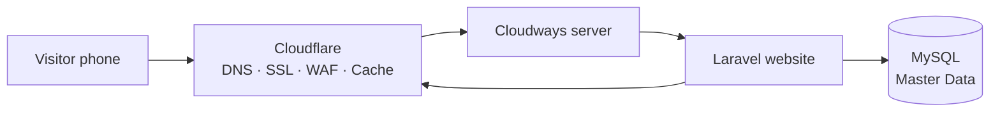
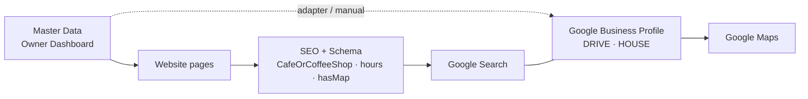
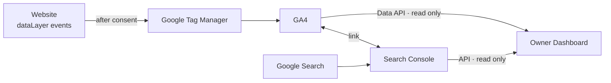
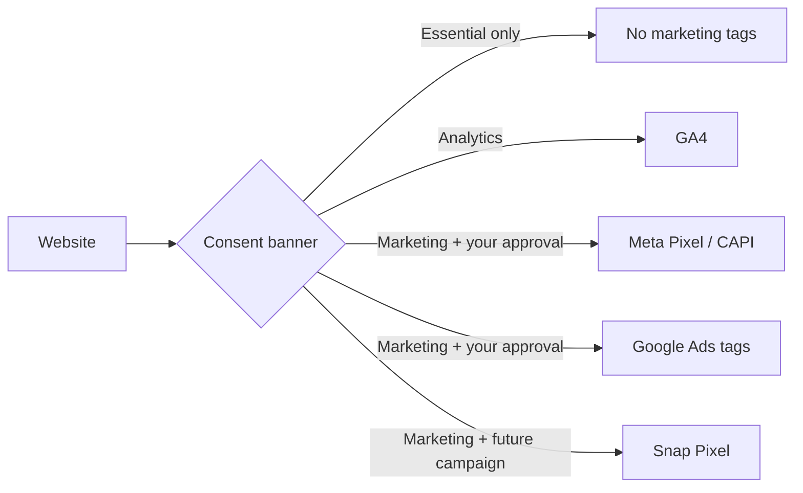

# SHELTER DIGITAL ECOSYSTEM — كيف تتصل الأنظمة ببعضها

| البند | القيمة |
|---|---|
| **الحالة** | `DRAFT — PENDING OWNER APPROVAL` (شرح، وليس قرارًا جديدًا) |
| **آخر تحديث** | 2026-10-02 |
| **لمن** | للـOwner: صورة واحدة بلا تفاصيل تقنية زائدة |
| **وثائق مرتبطة** | [`DIGITAL-INTEGRATIONS-RECOMMENDATIONS`](DIGITAL-INTEGRATIONS-RECOMMENDATIONS.md) · [`TRACKING-AND-COOKIES-INVENTORY`](TRACKING-AND-COOKIES-INVENTORY.md) · [`OWNER-CONNECTION-CHECKLIST`](OWNER-CONNECTION-CHECKLIST.md) · [`MASTER-DATA-HUB`](MASTER-DATA-HUB.md) · [`architecture/PLATFORM-ARCHITECTURE`](architecture/PLATFORM-ARCHITECTURE.md) |

## 1. الفكرة في سطرين
- **أنت تعدّل المعلومة مرة واحدة في لوحة التحكم.** الموقع والبيانات المنظمة (Schema) يقرآنها فورًا، وGoogle يأخذها من هناك.
- **كل خدمة خارجية (Google، Meta) «قناة» تأخذ نسخة.** إن تعطلت القناة، **الموقع يبقى يعمل**.

## 2. القطع، بلغة بسيطة
| القطعة | ما هي ببساطة | من يملكها | الحالة اليوم |
|---|---|---|---|
| **GitHub** | دفتر الوصفات: الكود كله وسجل كل تغيير. منه يُنشر الموقع | حساب المنشأة (`PENDING` — PO-037) | يعمل، والفحوص الآلية خضراء |
| **Cloudways** | المطبخ: السيرفر الذي يعمل عليه الموقع | حسابك (`PENDING` — PO-037) | الموقع القديم عليه. الجديد ينتظر أمرك (D-343) |
| **Cloudflare** | البوابة والحارس أمام المطبخ: يحمي ويسرّع ويدير الدومين (DNS) | حساب `info@shelterjo.com` | يعمل الآن أمام الموقع القديم |
| **Namecheap** | سجل ملكية الاسم `shelterjo.com` | حسابك (`PENDING` — PO-037) | الدومين مسجّل هناك |
| **الموقع (Laravel)** | المحل نفسه: الصفحات التي يراها الزبون بالعربي والإنجليزي | SHELTER | مبني ومختبر محليًا |
| **قاعدة البيانات (MySQL)** | خزانة الملفات: المنيو، الفروع، الطلبات، الإعدادات | SHELTER (على Cloudways) | مبنية (محليًا) |
| **Master Data** | **اللوح الرسمي الوحيد**: أسماء الفروع، الساعات، الهواتف، الأسعار | أنت (الحفظ = اعتماد) | مبني ومختبر |
| **لوحة التحكم (Owner Dashboard)** | غرفة التحكم: تعدّل كل شيء بلا كود، وترى الصحة والطلبات | أنت فقط (بـ2FA) | معظمها مبني (PHASE 3) |
| **Google Search Console** | تقرير Google عن موقعك: ماذا يبحث الناس، وأي صفحات تظهر، وأي أخطاء | حسابك على Google | قائم للموقع القديم — الوصول PO-011 |
| **Google Tag Manager (GTM)** | صندوق التوصيلات: يشغّل أدوات القياس المعتمدة فقط، وبموافقة الزائر | حساب Google للمنشأة | غير مثبت بعد |
| **Google Analytics 4 (GA4)** | عدّاد الزوار والأفعال: من فتح المنيو، ومن ضغط «الاتجاهات» | حساب Google للمنشأة | الموقع القديم يستخدمه — PO-012 |
| **Google Business Profile** | بطاقة كل فرع في Google: الاسم، الساعات، الهاتف، المراجعات | حسابك (PO-009) | قائم للفرعين |
| **Google Maps** | الخريطة التي يفتحها زر «الاتجاهات» | Google | الروابط مبنية (D-336) |
| **Meta (Facebook · Instagram)** | حساباتك الاجتماعية | حسابك (PO-026) | الروابط تنتظر تأكيدك |
| **Meta Pixel** | أداة قياس إعلانات Meta | حساب Meta للمنشأة | موجود في الموقع القديم فقط — PO-012 |
| **Snapchat** | حساب اجتماعي (ولاحقًا Pixel إن وُجدت حملة) | حسابك | ينتظر تأكيدك |
| **البريد (Google Workspace)** | بريد `@shelterjo.com` | حسابك | يعمل. الموقع لا يرسل بريدًا اليوم |
| **SEO (Schema · Sitemap · hreflang)** | لغة يفهمها Google عن كل صفحة | جزء من الموقع | مبني ومختبر |

## 3. رحلة الزائر (كيف تصل الصفحة)

1. الزائر يكتب `shelterjo.com`، فيصل أولًا إلى **Cloudflare**.
2. Cloudflare يرد من الـCache إن استطاع، وإلا يطلب الصفحة من **Cloudways**.
3. الموقع يقرأ المعلومة من **Master Data** في قاعدة البيانات ويبني الصفحة.

---

## 4. التدفق الأول: من المعلومة إلى خرائط Google

| # | ماذا يحدث |
|---|---|
| 1 | تعدّل ساعات DRIVE في اللوحة ← تُحفظ في **Master Data** |
| 2 | صفحة الفرع وبطاقته وحالة «مفتوح الآن» تتغير **فورًا** |
| 3 | البيانات المنظمة (Schema) في الصفحة تتغير معها، فيقرأها Google عند زيارته التالية |
| 4 | **Google Business Profile** يتحدث: اليوم يدويًا (اللوحة تعطيك خطوات MANUAL ACTION)، ولاحقًا عبر المحوّل بعد ربط الـAPI (PO-009) |
| 5 | **Google Maps** تعرض ما في Google Business Profile |

## 5. التدفق الثاني: من الزائر إلى أرقام لوحتك

| # | ماذا يحدث |
|---|---|
| 1 | الزائر يضغط «الاتجاهات» ← الموقع يسجّل حدث `directions_click` **بلا أي بيانات شخصية** |
| 2 | **GTM** يمرر الحدث إلى **GA4**، **فقط إن وافق الزائر** على Analytics |
| 3 | **Search Console** يجمع من Google: ماذا بحث الناس، وكم مرة ظهرت، وكم نقروا |
| 4 | GA4 وSearch Console يُربطان ببعض، فترى البحث والزيارة معًا |
| 5 | **لوحتك** تقرأ الأرقام من الاثنين بصلاحية **قراءة فقط**، وتعرضها بلغتك |

## 6. التدفق الثالث: التسويق (فقط إن اعتمدته)

- **لا شيء تسويقي يعمل افتراضيًا.** كل وسم إعلاني يحتاج **موافقتك** (حملة حقيقية) **و**موافقة الزائر **و**سياسة خصوصية منشورة (PO-019).
- **Meta CAPI** (من الخادم) مستقبلي فقط، بأقل البيانات ومشفّرة.
- **لا يصل إلى Meta أو Google أي شيء** من طلبات التوظيف أو الشراكات أو نص البحث.

---

## 7. مصدر الحقيقة الواحد (Single Source of Truth)
**مثال:** الجمعة القادمة عطلة، وHOUSE يغلق مبكرًا.

| بدون مصدر واحد | مع SHELTER Master Data |
|---|---|
| تعدّل الموقع، ثم Google Business، ثم Instagram، وتنسى واحدًا | **تعدّل مرة واحدة** في اللوحة ← الفروع والساعات ← ساعات خاصة |
| الزبون يرى ساعتين مختلفتين | الموقع والـSchema يتغيران فورًا |
| — | Google Business: يتحدث عبر المحوّل، أو تظهر لك مهمة يدوية واضحة |

**القواعد:**
- **Master Data هو المرجع.** Google Business نسخة منه (M33).
- **إن عدّل أحد شيئًا في Google مباشرة:** اللوحة تعرض `OUT OF SYNC` و**CONFLICT DETECTED**، وأنت تختار: احتفظ بالمعتمد · اعتمد تغيير Google · راجع. **لا اعتماد تلقائي لقيمة من Google أبدًا.**
- **الاسم والعنوان والدبوس (Pin)** في Google يدوية دائمًا، لأن تغييرها قد يطلب إعادة تحقق.

## 8. محولات القنوات (Channel adapters) — طبقة مستقبلية (PHASE 5)
**المحوّل** = مترجم صغير بين Master Data وخدمة خارجية. كل خدمة لها محوّل واحد، والموقع لا يعرف تفاصيلها.

| المحوّل (اسم مقترح) | ماذا يفعل | الاتجاه |
|---|---|---|
| `GoogleBusinessAdapter` | يرسل الهاتف والساعات والساعات الخاصة والإغلاق المؤقت. يقرأ للمقارنة | Master ← Google (بموافقتك) |
| `SearchConsoleAdapter` | يقرأ الاستعلامات والصفحات والفهرسة | قراءة فقط |
| `AnalyticsAdapter` | يقرأ أرقام GA4 للوحة | قراءة فقط |
| `MetaAdapter` | مستقبلي فقط (إن اعتُمد CAPI أو قراءة الحسابات) | — |

> الأسماء اقتراح تقني. **لا محوّل مبني بعد** (PHASE 5 `BLOCKED` على الصلاحيات PO-009…013).

**صحة كل تكامل في اللوحة** (النظام ← التكاملات) — بنفس مفردات [`INTEGRATION-REGISTRY`](platform/INTEGRATION-REGISTRY.md) و[`MASTER-DATA-HUB`](MASTER-DATA-HUB.md) §11:

| بلغة بسيطة | الحالة في النظام | ماذا ترى |
|---|---|---|
| متصل | `CONNECTED` / `SYNCED` | ✓ وآخر مزامنة ناجحة |
| جزئي | `DEGRADED` / `OUT OF SYNC` / `NOT SUPPORTED` | ⚠ ما الذي لم يتطابق، وزر «راجع» |
| فاشل | `FAILED` / `NEEDS_RECONNECT` / `MANUAL ACTION REQUIRED` | ✕ السبب بلغة مفهومة + «إعادة المحاولة» أو «أعد الربط» |
| لم يُربط بعد | `PENDING_ACCESS` / `NOT_CONFIGURED` | ما المطلوب منك |

- **إعادة المحاولة تلقائية:** بعد 1 ← 5 ← 30 دقيقة ← 6 ساعات. بعد 5 محاولات: `FAILED` وبند في «يحتاج انتباه».
- **القاعدة الذهبية: تعطل Google أو Meta لا يوقف الموقع أبدًا.** الموقع لا يتصل بأي خدمة خارجية أثناء عرض الصفحة. يعرض دائمًا Master Data.

## 9. ما لا يتصل عمدًا
| الحد | السبب |
|---|---|
| طلبات التوظيف والشراكات والاستفسارات **لا تصل لأي أداة تحليلات أو إعلان** | بيانات شخصية (D-246، D-259) |
| **الأسرار** (كلمات المرور والمفاتيح) لا تدخل Git ولا المحادثة ولا الواجهة | على السيرفر فقط (D-308) |
| **Staging** لا يرسل إلى GA4 الحقيقي، ولا يُفهرس، ولا يرسل بريدًا | لا خلط بين الفحص والإنتاج |
| **WordPress القديم** لا يُلمس حتى تقرر | للتراجع الآمن يوم الانتقال |
