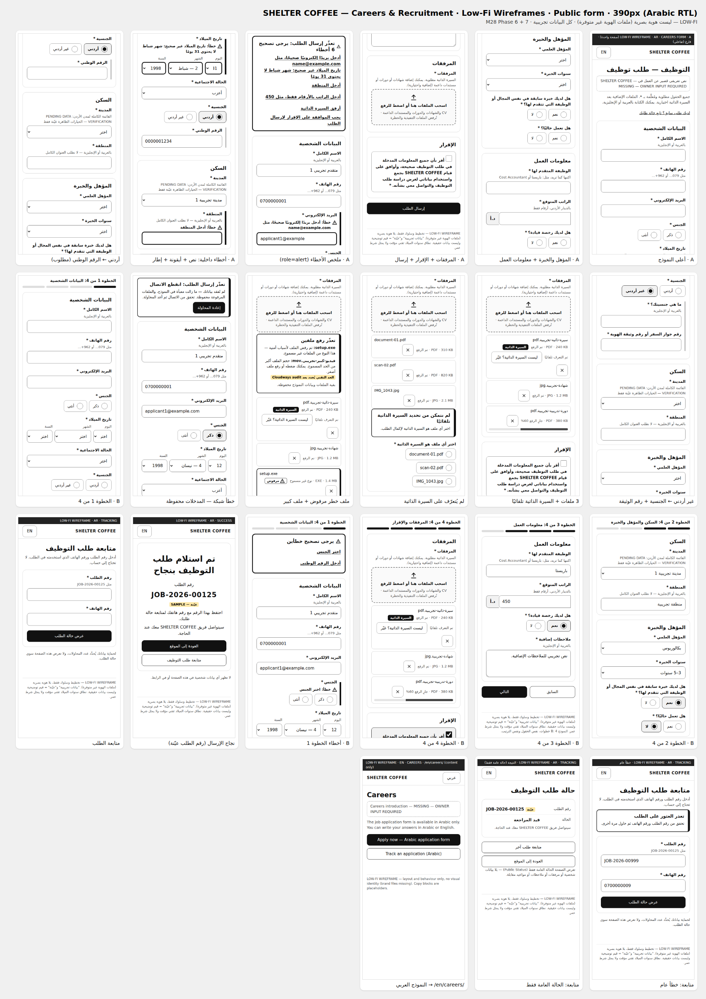
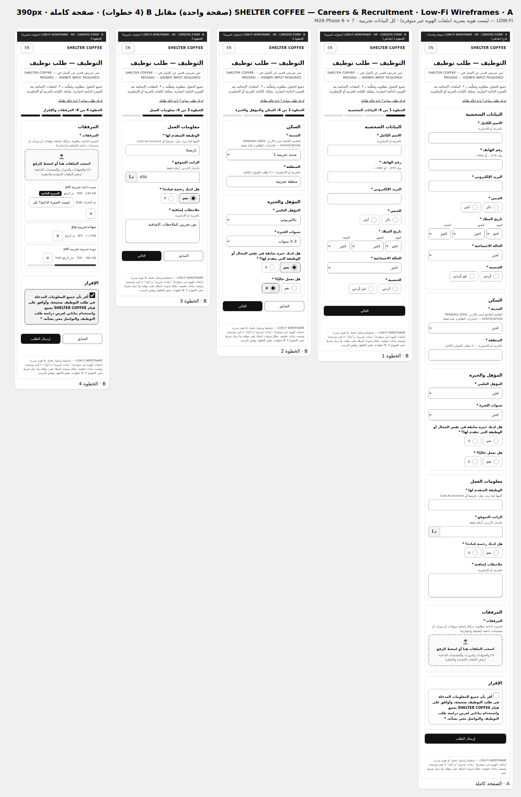
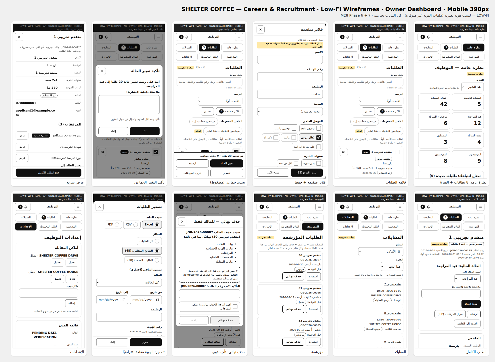
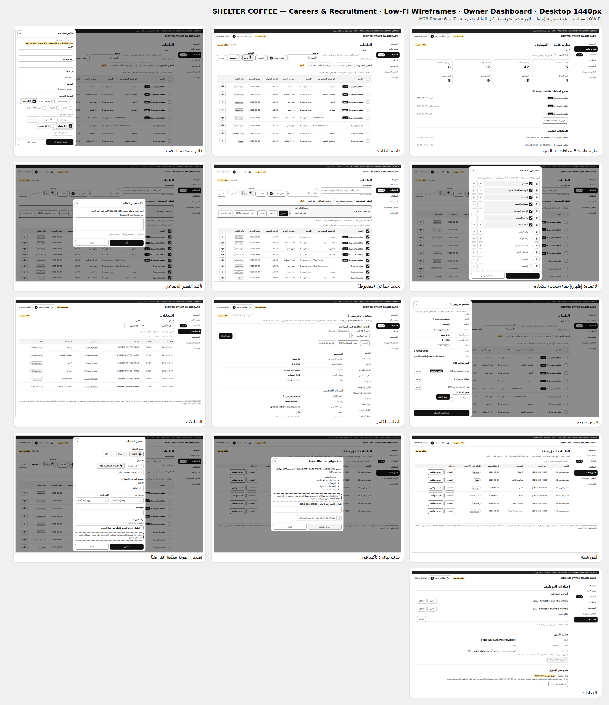

# Low-Fi Wireframes — Careers & Recruitment (M28 · Phase 6 + 7)

> **LOW-FI:** تخطيط وسلوك فقط. لا ألوان، ولا خطوط، ولا شعار — ملفات الهوية غير متوفرة (M-10).
>
> **المصدر:** المواصفة النهائية المعتمدة من المالك (M28). كل الحقول والخيارات منها حرفيًا — لا إضافة ولا حذف.
>
> **البيانات:** كلها تجريبية ومُعلَّمة `بيانات تجريبية` أو `عيّنة` (مثل «متقدم تجريبي 1»، `JOB-2026-00125`، `example.com`). لا أشخاص حقيقيون.
>
> **التصفح:** افتح [`html/index.html`](html/index.html) في أي متصفح. طريقة التوليد في [`tools/`](tools/).

## الأوراق المجمّعة
| النموذج العام — 390px | A مقابل B — صفحة كاملة — 390px |
|---|---|
|  |  |

| Owner Dashboard — Mobile 390px | Owner Dashboard — Desktop 1440px |
|---|---|
|  |  |

النموذج العام على 1440px: [`png/SHEET-public-1440.png`](png/SHEET-public-1440.png).

## قرار A/B: صفحة واحدة أم خطوات قصيرة؟
المالك فوّض هذا القرار التقني للاختبار (M28 §67): «Step Form فقط إذا أثبت الاختبار أنه أفضل … اختر الأسرع والأوضح».

| | |
|---|---|
| **Decision** | **A — صفحة واحدة منظمة** (6 مجموعات بعناوين) مع ملخص أخطاء في الأعلى يأخذ التركيز. B يبقى جاهزًا كبديل مختبَر. |
| **Reason** | B **لم يثبت أنه أفضل**. هو مقايضة: أقل تمريرًا وأخطاؤه أقرب، لكنه يضيف 3 ضغطات إلزامية وحالة خطوات (زر Back، فقدان تقدم جزئي). ولا يتفوق في السرعة. لذلك تبقى القاعدة الافتراضية للمالك: صفحة واحدة. |
| **Test** | `tooling/tests/prototype/careers.spec.mjs` → «A/B measurement». نفس الحقول الـ19 ونفس الترتيب ونفس المقدمة، مسار «أردني» + 3 ملفات، على 360 و390 و430. النتائج الخام: [`evidence/form-variant-measure.json`](evidence/form-variant-measure.json). |
| **Result** | انظر الجدول التالي. |

| القياس (390×844) | A — صفحة واحدة | B — 4 خطوات |
|---|---|---|
| طول الصفحة (شاشات) | 3.88 فارغة · 4.22 معبأة | 1.66 / 1.64 / 1.37 / 1.36 لكل خطوة |
| التفاعلات حتى الإرسال | **23** | 26 (+3 «التالي») |
| التمرير اللازم من المستخدم (شاشات) | 3.06 | **0.76** |
| أول خطأ ظاهر بلا تمرير بعد الإرسال | **نعم** (الملخص يأخذ التركيز) | **نعم** |
| إرسال فارغ: التمرير قبل أول ملاحظة | 2.88 شاشة · الملخص 19 خطأ (1.10 شاشة) | 0.66 شاشة · 7 أخطاء (0.44 شاشة) |
| خطأ واقعي (المنطقة فارغة فقط) | يظهر الملخص. الحقل نفسه يحتاج ضغطة واحدة على رابط الملخص | يُكتشف في الخطوة 2. الملخص والحقل ظاهران |

**على العروض الأخرى:** النمط نفسه.
- **360×800:**
  - A: 4.18 شاشة، وتمرير 3.37.
  - B: أطول خطوة 1.82، وتمرير 1.02.
- **430×932:**
  - A: 3.50 شاشة، وتمرير 2.67.
  - B: أطول خطوة 1.50، وتمرير 0.51.
- **التفاعلات:** 23 مقابل 26 على كل العروض.
- **الخطأ الأول:** ظاهر في A وB على كل العروض.

**الخلاصة:**
- **A:** أقل ضغطات. خطؤه الأول ظاهر دائمًا.
- **B:** أقل تمريرًا. خطؤه أقرب إلى الحقل.
- **مجموع الجهد** (ضغطات + تمرير + ضغطة تصحيح) متقارب. لا يوجد فائز واضح في «الأسرع»، فلا مبرر لزيادة الخطوات (§67).

**متى نعيد الاختبار:**
- بعد الإطلاق، عبر أحداث privacy-safe: `application_started` / `application_submitted` / `application_error`.
- إذا ظهر تسرب واضح قبل الإرسال، يُختبر B مع مستخدمين حقيقيين. نسخته جاهزة هنا بنفس الحقول.

> **حدود القياس:**
> - قياس آلي (Playwright)، وليس اختبار مستخدمين.
> - «التمرير» هو أقل مسافة لإظهار كل حقل.
> - لوحة المفاتيح الافتراضية غير محسوبة.

## ترتيب الحقول (6 مجموعات · 19 حقلًا)
1. **البيانات الشخصية:**
   - الاسم الكامل · رقم الهاتف · البريد الإلكتروني · الجنس.
   - تاريخ الميلاد: 3 Selects (يوم / شهر بأسماء عربية / سنة تنازلية).
   - الحالة الاجتماعية.
   - الجنسية:
     - أردني ← الرقم الوطني.
     - غير أردني ← ما هي جنسيتك؟ + رقم جواز السفر أو رقم وثيقة الهوية.
2. **السكن:**
   - المدينة: Select. القائمة `PENDING DATA VERIFICATION`، وتظهر 3 خيارات عيّنة فقط.
   - المنطقة.
3. **المؤهل والخبرة:**
   - المؤهل العلمي.
   - سنوات الخبرة.
   - خبرة سابقة في نفس المجال.
   - هل تعمل حاليًا؟
4. **معلومات العمل:**
   - الوظيفة المتقدم لها: نص حر بلا Autocorrect.
   - الراتب المتوقع: أرقام + لاحقة `د.أ`.
   - رخصة القيادة.
   - ملاحظات إضافية.
5. **المرفقات:** منطقة رفع واحدة. السيرة الذاتية مطلوبة.
6. **الإقرار:** نص المالك الحرفي.

**قواعد عامة:**
- كل الحقول مطلوبة ومُعلَّمة بـ`*`، وكذلك الحقول الشرطية فور ظهورها.
- حقول النص تقبل العربية والإنجليزية (`dir="auto"`).
- الترتيب داخل المجموعات يتبع أقسام المالك (§06–§21).

## الشاشات
**النموذج العام (`lang="ar" dir="rtl"`)**

| الملف | الحالة |
|---|---|
| `form-a.html` | A تفاعلي: إظهار الحقول الشرطية، وفحص الحقول، وملخص الأخطاء، والتعرف على السيرة الذاتية من اسم الملف، ثم صفحة النجاح |
| `form-a-errors.html` | ملخص أخطاء `role="alert"` يربط بالحقول. كل خطأ داخلي = نص «خطأ:» + أيقونة + إطار، وليس لونًا فقط |
| `form-a-jo.html` · `form-a-nonjo.html` | الحقول الشرطية للجنسيتين |
| `form-a-upload.html` | 3 ملفات. واحد عليه شارة «السيرة الذاتية» (تعرّف تلقائي). ملف أثناء الرفع |
| `form-a-cv-unknown.html` | «لم نتمكن من تحديد السيرة الذاتية» ← «اختر أي ملف هو السيرة الذاتية» |
| `form-a-file-errors.html` | ملف تنفيذي مرفوض + ملف أكبر من الحد. بقية الملفات والبيانات محفوظة |
| `form-a-network.html` | انقطاع الاتصال. كل المدخلات والملفات محفوظة، وزر «إعادة المحاولة» |
| `form-b*.html` | B: 4 خطوات + مؤشر تقدم، والحالات نفسها |
| `success.html` | رقم الطلب `JOB-2026-00125` (عيّنة) وزر العودة. لا بيانات حساسة في الصفحة ولا في الرابط |
| `track*.html` | رقم الطلب + الهاتف. خطأ عام «تعذر العثور على الطلب». النتيجة: الحالة العامة فقط |
| `en-careers.html` | `/en/careers/` (EN/LTR): محتوى فقط. زر Apply ينقل إلى النموذج العربي |

**Owner Dashboard:**
- النسخ: `d-*` لعرض 1024px فأكثر، و`m-*` لما دونه.
- الشاشات: نظرة عامة · قائمة الطلبات · فلاتر متقدمة · الأعمدة · تحديد جماعي · تأكيد جماعي · عرض سريع · الطلب الكامل · المقابلات · المؤرشفة · حذف نهائي · تصدير · الإعدادات.
- الموبايل يعرض **بطاقات** بدل الجدول، ولا يحتاج اختيار الأعمدة.

## اختيارات تقنية داخل الـWireframes (ليست قرارات Business)
- **أسماء الشهور:** شامية (كانون الثاني…) مع رقم الشهر.
- **نطاق سنوات الميلاد** (2010 ← 1946): مؤقت، ولا يمثل شرط عمر.
- **ملخص الأخطاء:**
  - يأخذ التركيز (Focus) بعد الإرسال.
  - كل رابط فيه ≥ 44px.
  - في B يظهر أعلى الخطوة الحالية فقط.
- **عدد الصفوف:** الافتراضي 50 على الموبايل أيضًا. المالك حدده للـDesktop فقط.
- **السكربت الوحيد:** سكربت صغير في `form-a.html` و`form-b*.html` لأغراض القياس فقط، وليس كود إنتاج. صفحات الـDashboard بلا سكربت.

## ما زال معلّقًا (لا يُخترع)
| البند | الحالة |
|---|---|
| قائمة مدن الأردن | `PENDING DATA VERIFICATION` |
| حد حجم الملف | يُحدد بعد Cloudways audit (§18) |
| نص الحالة العامة المحايدة بعد «تمت المقابلة» و«مقبول» | يُحدد في `RECRUITMENT-PUBLIC-STATUS-MAPPING.md` |
| نص مقدمة صفحة التوظيف (AR/EN) | `MISSING — OWNER INPUT REQUIRED` |
| حد «الطلبات القديمة» | يُحدد لاحقًا |

## التوليد والاختبار
```bash
cd docs/careers/wireframes/tools
python3 build.py      # → ../html (44 صفحة، deterministic)
node sheets.cjs       # → ../png/SHEET-*.png (يستخدم @playwright/test من tooling/)
cd ../../../../tooling
npx playwright test tests/prototype/careers.spec.mjs   # يكتب أيضًا ../evidence/form-variant-measure.json
```

**ما يُفحص في كل صفحة × كل Viewport** (`tooling/viewports.mjs`):
- `lang`/`dir`.
- `h1` واحد.
- لا تجاوز أفقي.
- لا قص للنص.
- نص ≥ 12px.
- أهداف اللمس ≥ 44px على العروض اللمسية.
- كل Input/Select له Label.
- الـDialog داخل الشاشة، وزر الإغلاق ≥ 44px.
- axe WCAG 2.2 AA بلا Serious/Critical.

**فحوص إضافية:**
- **السلوك:** ملخص الأخطاء، والحقول الشرطية، و`getByLabel` لكل الحقول.
- **عقد المواصفة:** مرة واحدة على 390 و1440. تشمل الحقول والخيارات المجمّدة، والأعمدة الـ7، والفلاتر الـ10، وخيارات الترتيب الـ6، وعدد الصفوف 25/50/100، ونص التأكيد الجماعي، وغياب الحذف الجماعي، والرقم المقنّع، ومكان المقابلة DRIVE/HOUSE.
