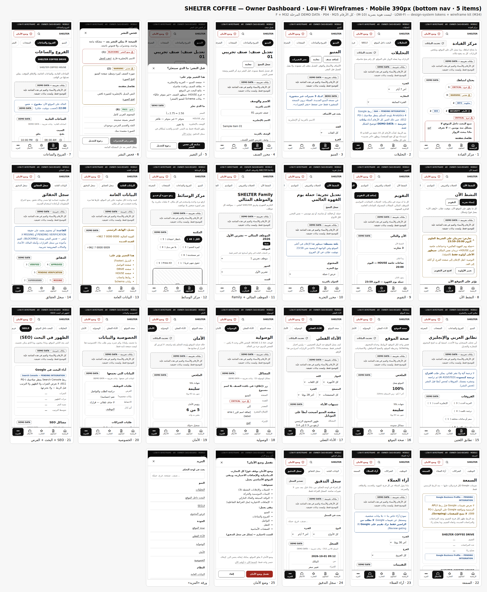
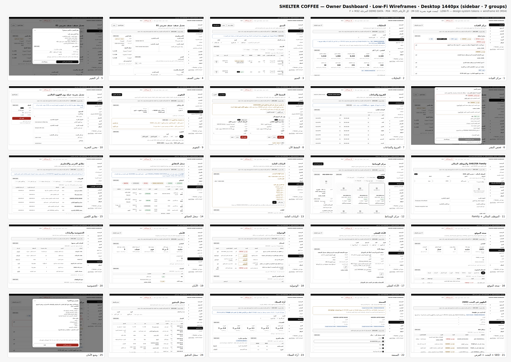

# Low-Fi Wireframes — Owner Dashboard (P04 · M25 Phase F + M32)

> **LOW-FI:** هذه الجولة تعرض التخطيط والسلوك فقط. لا هوية بصرية فيها، لأن ملفات الهوية غير متوفرة (M-10).
>
> **نظام التصميم:** نظام واحد (M34، FROZEN P0). كل صفحة تضمّن الملفين المشتركين [`design-system/build/tokens.css`](../../../design-system/build/tokens.css) و[`design-system/wireframe-kit.css`](../../../design-system/wireframe-kit.css) كما هما.
> - الواجهة مبنية من مكوّنات `ds-*` وحدها: الأزرار، والحقول، والـChips، والـBadges، والبطاقات، والجداول، والتنبيهات، و`ds-modal`/`ds-sheet`.
> - CSS الخاص بالـDashboard يقتصر على الهيكل: الشريط الجانبي، والشريط السفلي، والشبكات. ويستخدم `var(--…)` فقط، فلا px خام ولا Hex.
>
> **البيانات:** كل رقم في هذه الشاشات **تجريبي**، وعليه وسم `بيانات تجريبية — DEMO DATA`. لا يوجد أي رقم حي (DASH-024).
> - الأصناف والموظفون والمراجعات أسماؤها تجريبية، مثل «صنف تجريبي 01» و«موظف تجريبي 1».
> - الأرقام والهواتف وهمية، مثل `+962 7 0000 0000`.
> - التكاملات غير المربوطة تظهر `PENDING INTEGRATION`: GA4، وSearch Console، وGoogle Business Profile.
>
> **الحالة:** `DRAFT — PENDING OWNER REVIEW`. هذه الجولة تخدم بوابتين:
> - **Phase F → G (UX review) → H (Owner approval)** في DASH-004.
> - **J-2** في [`GAP-CLOSURE-PLAN.md`](../../GAP-CLOSURE-PLAN.md).
>
> **تحديث M36:** هذه الجولة المراجعة **غير مانعة** (READY FOR REVIEW)، والبناء بالمراحل. البوابات المانعة: الإنتاج وDNS وGoogle الحي والخدمات المدفوعة والحقائق غير المعتمدة. البناء يسير في PHASE 3.
>
> **التصفح:** افتح [`html/index.html`](html/index.html). طريقة التوليد في [`tools/`](tools/).

## الأوراق المجمّعة
| Mobile — 390px | Desktop — 1440px |
|---|---|
|  |  |

## الهيكل (Shell)
**Desktop (1024px فأكثر):**
- شريط علوي ثابت فيه:
  - البحث العام (DASH-019).
  - زر **«وضع الأمان»**.
  - «المالك».
- شريط جانبي من **7 مجموعات** (GAP-CLOSURE-PLAN §C):
  - **الرئيسية:** رابط مباشر.
  - **6 مجموعات قابلة للطي** (`<details>`): المحتوى · التجارب · الأعمال · النمو · الجودة · النظام.
  - المجموعة الحالية مفتوحة، والباقي مطوي.
- تذكير «دخول آمن» أسفل الشريط الجانبي.

**Mobile (أقل من 1024px):**
- **شريط علوي:**
  - الشعار.
  - زر البحث، ويفتح ورقة «المزيد» على حقل البحث.
  - زر **«وضع الأمان»**.
  - الشريط ثابت (Sticky) عندما يكون ارتفاع الشاشة 500px أو أكثر.
- **صف Chips** يعرض بنود المجموعة الحالية.
- **شريط سفلي بخمسة عناصر:** الرئيسية · المحتوى · التجارب · الأعمال · المزيد.
- **ورقة «المزيد»** ([`m-more.html`](html/m-more.html)) تعرض:
  - البحث.
  - النمو · الجودة · النظام.

| المجموعة | البنود (رابط كل بند) |
|---|---|
| الرئيسية | مركز القيادة |
| المحتوى | المنيو · الفروع والساعات · الصفحات* · المعرفة (المدونة)* · الفعاليات (← التقويم مفلترًا) · مركز الوسائط · تطابق العربي والإنجليزي |
| التجارب | النشط الآن · الحملات والعروض (← التقويم) · المواسم (← التقويم) · التقويم · SHELTER Family والموظف المثالي |
| الأعمال | التوظيف (→ [`docs/careers/wireframes`](../../careers/wireframes/)) · الشراكات (→ [`docs/franchise/wireframes`](../../franchise/wireframes/)) · آراء العملاء · السمعة |
| النمو | التحليلات · البحث داخل الموقع (← SEO) · الـSEO · فرص المحتوى (← SEO) |
| الجودة | صحة الموقع · الأداء الفعلي · الوصولية · الأمان · الخصوصية |
| النظام | البيانات العامة · سجل الحقائق · سجل التدقيق · الإعدادات* |

\* تصميمها في جولة لاحقة. صفحتها الحالية: [`d-later.html`](html/d-later.html).

## الشاشات (25 × Desktop + Mobile)
النسخة `d-<name>.html` لعرض 1024px فأكثر، والنسخة `m-<name>.html` لما دونه.

| # | الشاشة | الملف | المتطلب / المجال |
|---|---|---|---|
| 1 | **مركز القيادة:**<br>- «يحتاج انتباهك» مجمّعًا: حرج · تحذير · معلومة · الأمان · SEO.<br>- النشط الآن، وما يبدأ وينتهي قريبًا.<br>- زيارات اليوم والأسبوع والشهر.<br>- إجراءات الهاتف السريعة.<br>- مصادر البيانات | `home` | DASH-007 · DASH-017 · DASH-018 · DASH-028 · M32 §39–41 |
| 2 | **التحليلات:**<br>- الفترات والمقارنة.<br>- 10 مؤشرات.<br>- رسم صغير واحد على Desktop مع عرضه كجدول، وملخص بدله على Mobile.<br>- الصفحات، والقنوات، وإجراءات العملاء حسب الفرع.<br>- الأجهزة واللغة، والمنيو | `analytics` | DASH-008…012 · DASH-030 · M25 §3–12 |
| 3 | **المنيو:**<br>- قائمة الأصناف (جدول على Desktop، بطاقات على Mobile).<br>- فلاتر سريعة.<br>- حالة المسودة.<br>- إجراءات جماعية | `menu` | CMS-005 · CMS-015 · M25 §23–24 |
| 4 | **محرر الصنف:**<br>- الاسم بالعربية والإنجليزية، والوصف، والسعر بـ`د.أ`.<br>- الفئة والقسم الفرعي، والترتيب.<br>- **التوفر لكل فرع بأربع حالات.**<br>- الصورة من مركز الوسائط، وشارتا جديد/موسمي.<br>- حفظ، معاينة، نشر، أرشفة، وسجل النسخ | `product` | CMS-015/016 · menu IA §9.6 · §18 · M30 MENU |
| 5 | **أثر التغيير:** Dialog «هذا التغيير يؤثر على: …» مع ما تغيّر (قبل ← بعد) | `impact` | M32 §04 |
| 6 | **فحص النشر:**<br>- النتائج BLOCKING / WARNING / PASS.<br>- تجاوز التحذيرات بسبب يُسجَّل في سجل التدقيق.<br>- زر النشر معطّل ما دامت هناك مشكلة مانعة | `guard` | M32 §05 |
| 7 | **الفروع والساعات:**<br>- الساعات العادية (7 أيام).<br>- الساعات الخاصة: رمضان، عطلة، تغيير مؤقت.<br>- الإغلاق المؤقت.<br>- الهاتف والواتساب **للقراءة فقط من البيانات العامة**.<br>- أثر التعديل | `branch` | CMS-013 · D-021 · M25 §25–26 |
| 8 | **النشط الآن:**<br>- «أوقف الآن» لكل تجربة.<br>- الأولوية لكل تجربة.<br>- تحذير التعارض والتوصية.<br>- ترتيب الأولوية الافتراضي | `active` | M31 §11–12 · DX §3, §5 |
| 9 | **التقويم الموحد:**<br>- شهر / أسبوع / قائمة.<br>- علامات التعارض.<br>- الآن والتالي | `calendar` | M32 §08–10 |
| 10 | **محرر الحملة / التجربة:**<br>- النوع، والنص بالعربية والإنجليزية، والزر.<br>- **شكل العرض (واحد فقط)**.<br>- الجدولة بتوقيت عمّان، والفروع، والأولوية مع التعارض.<br>- الوسائط، والعدّاد، والحركة، والشروط.<br>- **المعاينة حسب التاريخ** | `experience` | M25 §27 · M31 §3–4, §13–14, §22–23 |
| 11 | **الموظف المثالي + SHELTER Family:**<br>- النشر ممكن فقط بموافقة الموظف المسجلة.<br>- لا بيانات HR.<br>- الأرشيف | `family` | M31 §1–2, §27 |
| 12 | **مركز الوسائط:**<br>- المكتبة.<br>- الحقوق: المصور، المصدر، حقوق الاستخدام، موافقة الأشخاص، صالح للموقع، صالح للإعلانات، القيود، الانتهاء.<br>- الاستخدامات.<br>- الأرشفة ممنوعة إذا كانت الصورة مستخدمة.<br>- **Press Kit** كمجموعة منتقاة | `media` | MEDIA-012…015 · M32 §17–18 |
| 13 | **البيانات العامة:**<br>- العلامة، والتواصل، والفروع، والسوشال، والموقع العام.<br>- تعديل الهاتف مع قائمة الأثر بنص المالك | `global-data` | M32 §02, §04 |
| 14 | **سجل الحقائق:**<br>- 6 حالات بالضبط.<br>- المصدر ومن اعتمد.<br>- «مستخدمة في» روابط | `facts` | M32 §03 |
| 15 | **تطابق العربي والإنجليزي:** الفروقات مع الأحدث والإجراء | `parity` | M32 §07 |
| 16 | **صحة الموقع:**<br>- جدول مشاكل واحد: الحداثة، الروابط، Schema، Sitemap، الفهرسة `PENDING INTEGRATION`.<br>- النسخ الاحتياطي **مع آخر اختبار استعادة**.<br>- الاعتماديات بالحالات GOOD / UPDATE AVAILABLE / SECURITY UPDATE / CRITICAL | `health` | DASH-014 · M32 §06, §33–38 |
| 17 | **الأداء الفعلي (RUM p75):**<br>- LCP / INP / CLS حسب الصفحة والجهاز.<br>- التنبيهات بالأدلة، و**«لن نخمّن السبب»** عند غياب الدليل | `performance` | PERF-020 · M32 §11–12 |
| 18 | **الوصولية:**<br>- المشاكل مع مصدرها: آلي أو يدوي.<br>- قائمة الفحص اليدوي | `a11y` | M25 §40 · M32 §31–32 |
| 19 | **الأمان:**<br>- SSL، والرؤوس، وCSP.<br>- Passkey و2FA ورموز الاسترداد.<br>- نشاط الدخول (فاشل ومشبوه)، والجلسات، وآخر نسخة.<br>- **لا أسرار** | `security` | SEC-005…009 · M32 §19–20 |
| 20 | **الخصوصية والبيانات:**<br>- قائمة البيانات، ونسخ الموافقات.<br>- **عمر السجلات بلا حذف تلقائي**.<br>- طلبات الخصوصية، والكوكيز، ونسخ السياسات | `privacy` | PRIV-* · M32 §21–22 |
| 21 | **SEO + البحث داخل الموقع + فرص المحتوى:**<br>- Search Console `PENDING INTEGRATION`.<br>- مشاكل SEO.<br>- الأكثر بحثًا، وبلا نتائج، والصاعد.<br>- فرص «أنت تقرر» | `seo` | SEO-038 · DASH-013 · M32 §28–30 |
| 22 | **السمعة:**<br>- حالة `PENDING INTEGRATION` لكل فرع.<br>- مسار الرد: مراجعة ← رد مقترح ← تعديلك ← اعتمادك ← النشر | `reputation` | M32 §13–14 |
| 23 | **آراء العملاء:**<br>- 5 تقييمات، ومقارنة الفروع.<br>- مواضيع `AI ASSISTED ANALYSIS`.<br>- التعليقات.<br>- لا Review gating | `feedback` | M32 §15–16 |
| 24 | **سجل التدقيق:**<br>- من، ماذا، قبل، بعد، السياق: تجاوز النشر، وضع الأمان، كشف الهوية…<br>- سجل النسخ مع «استعادة كمسودة» | `audit` | M25 §34–35 · M30 |
| 25 | **تأكيد وضع الأمان:**<br>- ما يتوقف.<br>- ما يبقى: المنيو، الفروع والساعات، التواصل، التنقل، الصفحات الأساسية.<br>- السبب يُسجَّل | `safe-mode` | M32 §23–24 |

**صفحات إضافية:**
- `d-later` / `m-later`: وحدات في الـIA لم تُصمم بعد.
- `m-more`: ورقة «المزيد».
- `index`: فهرس الشاشات.

**المجموع:** 54 صفحة HTML.

**تغطية الـ12 شاشة في DASH-005:**

| شاشة DASH-005 | تغطيها هنا |
|---|---|
| Desktop Overview + Mobile Overview | 1 |
| Analytics | 2 |
| Menu Editor | 3 |
| Product Editor | 4 |
| Branch Editor | 7 |
| Campaign Editor | 10 |
| SEO Health | 21 |
| Site Health | 16 |
| Performance | 17 |
| Media Library | 12 |
| Audit Log | 24 |

## ما أضيف على مستوى الصفحة (غير موجود في `wireframe-kit.css`)
كل الإضافات من الـTokens فقط. الملفان المشتركان لم يُعدّلا.

| الإضافة | السبب |
|---|---|
| ألوان حالة للـBadge (`.tone-success/warning/danger/info/muted/solid`) | الـKit فيه `.ds-badge` واحد بلا ألوان. الحالات (حرج، تحذير، APPROVED…) تحتاج لونًا دلاليًا إضافة إلى النص |
| حالة «الحالي» للـChip عند `aria-current="page"` (التنقل وأدوات التبديل) | الـKit يغطي `aria-current="true"` و`aria-pressed` فقط |
| Dialog بترويسة وتذييل ثابتين وجسم يمرّر (`.dlg` فوق `.ds-modal`/`.ds-sheet`) | `ds-modal` يمرّر كاملًا، فقد يختفي زر التأكيد أسفل الشاشة القصيرة (مثل 568×320) |
| `.vh` لنص مخفي بصريًا للقارئات | غير موجود في الـKit |
| الهيكل: الشريط الجانبي، والشريط السفلي، وصف Chips المجموعة، وشبكات البطاقات، وشبكة التقويم، ولاحقة الحقل `د.أ` | أنماط خاصة بالـDashboard |

**ملاحظة للـAudit:** المخالفات الأربع في عمود الألوان مصدرها الملفان المشتركان، والقيمة نفسها في كل المجموعات:
- قيم `rgb()` في ظلال `tokens.css`.
- قيمة `rgb()` في `.ds-overlay` داخل `wireframe-kit.css`.

وكذلك أسماء الأزرار العشرة: هي متغيرات `ds-btn` نفسها من الـKit.

## قرارات الـIA في هذه الجولة (Decision · Reason)
| # | Decision | Reason |
|---|---|---|
| IA-D1 | **«الرئيسية» رابط مباشر، والمجموعات الست الأخرى قابلة للطي. المجموعة الحالية فقط مفتوحة** | §C: «7 مجموعات، لا 40 بندًا». الطي يُبقي الشريط قصيرًا، ويحتاج ضغطة واحدة للوصول لأي بند |
| IA-D2 | **«الفروع والساعات» داخل «المحتوى»**، مع أن §C لم يذكرها صراحة | تعديل الساعات مهمة يومية من الهاتف (M26 #6). وضعها داخل «النظام ← البيانات العامة» يخفيها. **البيانات نفسها** (الهاتف، الواتساب، العنوان) تبقى في البيانات العامة، ومحرر الفرع يقرأها فقط، فلا يوجد مصدر ثانٍ |
| IA-D3 | **«تطابق العربي والإنجليزي» داخل «المحتوى»** | الإصلاح دائمًا تعديل محتوى. المشاكل نفسها تظهر أيضًا في جدول «صحة الموقع» الموحد، فهما Health Engine واحد بعرضين، وليسا مركزين |
| IA-D4 | **«الفعاليات» و«الحملات والعروض» و«المواسم» تفتح التقويم الموحد مفلترًا حسب النوع.** «النشط الآن» هو قائمة التجارب الحية | M32 §47: لا تقويم ثانٍ ولا قوائم مكررة. محرك واحد (DX) وعرض واحد لكل ما له موعد |
| IA-D5 | **«البحث داخل الموقع» و«فرص المحتوى» أقسام في شاشة SEO** (`#search` · `#opps`) | المصدر واحد: سجل البحث + Search Console. الشاشة تجيب سؤالًا واحدًا: كيف يجدنا الناس وماذا ينقصهم؟ |
| IA-D6 | **Schema وSitemap والفهرسة تُعرض في «صحة الموقع»، وشاشة SEO تربط إليها** | §B: Health Engine واحد وجدول `issues` واحد |
| IA-D7 | **التوظيف والشراكات روابط إلى وحداتهما المصممة** | المطلوب صراحة: لا إعادة بناء. التوظيف في [`docs/careers/wireframes`](../../careers/wireframes/)، والشراكات في [`docs/franchise/wireframes`](../../franchise/wireframes/) |
| IA-D8 | **Mobile: الشريط السفلي يفتح أول بند في المجموعة، وصف Chips أفقي يعرض باقي البنود.** «المزيد» ورقة (Bottom Sheet) للنمو والجودة والنظام مع البحث | §C: 5 عناصر. صف الـChips حاوية تمرير أفقي مضبوطة، فلا تمرير أفقي للصفحة |
| IA-D9 | **«وضع الأمان» زر في الشريط العلوي لكل شاشة.** على الموبايل يبقى الشريط العلوي ثابتًا عندما يكون الارتفاع 500px أو أكثر. في الوضع الأفقي القصير (مثل 568×320) لا يثبت، حفاظًا على مساحة المحتوى | §C + M32 §23. الزر يفتح تأكيدًا واحدًا (شاشة 25) |
| IA-D10 | **التقويم على الهاتف يفتح بعرض «قائمة».** عرض الشهر للشاشات الأكبر | شبكة 7 أعمدة لا تعطي أهداف لمس 44px على عرض 320px |
| IA-D11 | **الجداول على Desktop داخل حاوية تمرير قابلة للتركيز. تحت 1024px تتحول بطاقات (لا جدول)** | M26 «TABLES». لا بيانات مخفية على الهاتف |
| IA-D12 | **رسم بياني صغير واحد فقط** (اتجاه الزيارات على Desktop) مع «عرض كجدول». على Mobile ملخص نصي بدله | M25 §48 + M26 «CHARTS»: البطاقات والجداول أولًا |
| IA-D13 | **كل بند «يحتاج انتباه» رابط إلى مكان الإجراء.** التفاصيل التقنية تحت «تفاصيل متقدمة» القابلة للطي | M32 §40–41 · DASH-018/020 |
| IA-D14 | **أثر التغيير ← فحص النشر ← النشر هو مسار النشر.** يُرسم كاملًا على مثال الصنف. الفروع والبيانات العامة تعرض قائمة الأثر داخل الشاشة | M32 §04–05. خط نشر واحد لكل الكيانات (§B) |
| IA-D15 | **لا إدارة مستخدمين ولا أدوار في أي شاشة.** «الإعدادات» تنص على ذلك صراحة | M30: FROZEN، Owner فقط في V1 |
| IA-D16 | **«DEMO DATA» على كل بطاقة بيانات، ومعه «آخر تحديث» ومصدر البيانات.** شريط تنبيه على مستوى الصفحة. التكاملات غير المربوطة `PENDING INTEGRATION` بلا أرقام مخترعة (Search Console، السمعة) | DASH-022/024 · M32 J-5 |

## ما زال معلّقًا (لا يُخترع)
| البند | الحالة |
|---|---|
| ربط GA4 / Search Console / Google Business Profile | `PENDING INTEGRATION`. الصلاحيات: PO-012 · PO-011 · PO-009 |
| تصنيف خصوصية RUM والآراء | ضمن PO-019 (J-6) |
| شاشات الصفحات (محرر الأقسام)، والمعرفة، والإعدادات | الجولة التالية بعد اعتماد هذه |
| نقاش UX لنظام الساعات الخاصة مع المالك | CMS-014 / DB-18 مفتوح. الشاشة 7 هي المقترح |
| الهاتف، والبريد، وروابط السوشال، وقصة العلامة، والشعار، والسياسات | `MISSING — OWNER INPUT REQUIRED` / PENDING VERIFICATION. القيم المعروضة تجريبية |
| الاسم النهائي للوحة | SHELTER OWNER DASHBOARD أو SHELTER WEBSITE CONTROL CENTER (DASH-001، غير مانع) |
| ألوان وخطوط الهوية | M-10. الـTokens اليوم Placeholders رمادية مع ألوان حالة دلالية |
| تمرير صف الـChips على الموبايل إلى البند الحالي | يحتاج سطرًا واحدًا عند البناء (`scrollIntoView`). الـWireframe ثابت بلا JS |

## التوليد والاختبار
```bash
cd docs/dashboard/wireframes/tools
python3 build.py      # → ../html (54 صفحة، deterministic، يضمّن tokens.css + wireframe-kit.css)
node sheets.cjs       # → ../png/SHEET-dashboard-{390,1440}.png (يستخدم @playwright/test من tooling/)
cd ../../../../tooling
npx playwright test tests/prototype/dashboard.spec.mjs   # الخادم :4177 من playwright.config.mjs
node scripts/ds-audit.mjs                                # → docs/DESIGN-SYSTEM-HEALTH.md
```

**ما يُفحص على كل شاشة وكل Viewport** (`tooling/viewports.mjs`، 20 عرضًا: `d-*` من 1024px، و`m-*` لما دونه):
- `lang="ar"` و`dir="rtl"`، و`h1` واحد.
- لا تجاوز أفقي، ولا نص مقصوص، ولا نص أصغر من 12px.
- أهداف اللمس 44px أو أكثر على العروض اللمسية، بما فيها `<summary>`.
- كل حقل له Label.
- الـDialog داخل الشاشة، وزر الإغلاق والأزرار ظاهرة.
- axe WCAG 2.2 AA بلا مخالفات Serious أو Critical.

**عقد الـIA والمحتوى** (مرة واحدة على 390 و1440):
- **الهيكل:**
  - 7 مجموعات (6 منها قابلة للطي) على Desktop، و5 عناصر سفلية وورقة «المزيد» على Mobile.
  - «وضع الأمان» في كل شاشة.
  - لا روابط إدارة مستخدمين أو أدوار، ولا حقل كلمة مرور.
- **البيانات:**
  - كل رقم داخل كتلة عليها DEMO DATA، ولا يظهر «LIVE DATA».
  - «آخر تحديث» على كل بطاقة بيانات.
  - كل الروابط والـAnchors الداخلية تعمل.
- **مركز القيادة وشاشة الوسائط:**
  - كل بند في «يحتاج انتباه» رابط يعمل.
  - GA4 / Search Console / GBP بحالة `PENDING INTEGRATION`.
- **الحالات المجمّدة:**
  - التوفر 4 حالات، وشكل العرض 5 خيارات.
  - حالات الحقائق 6، وحالات الاعتماديات 4، وحالات RUM 3.
  - مسار الرد 5 خطوات، وما يبقى في وضع الأمان 5 بنود.
- **فحص النشر:** BLOCKING / WARNING / PASS، والنشر معطّل.
- **نظام التصميم (M34):**
  - الملفان المشتركان مضمّنان.
  - لا Hex ولا px خام في CSS الصفحة.
  - لا `style=""`.
