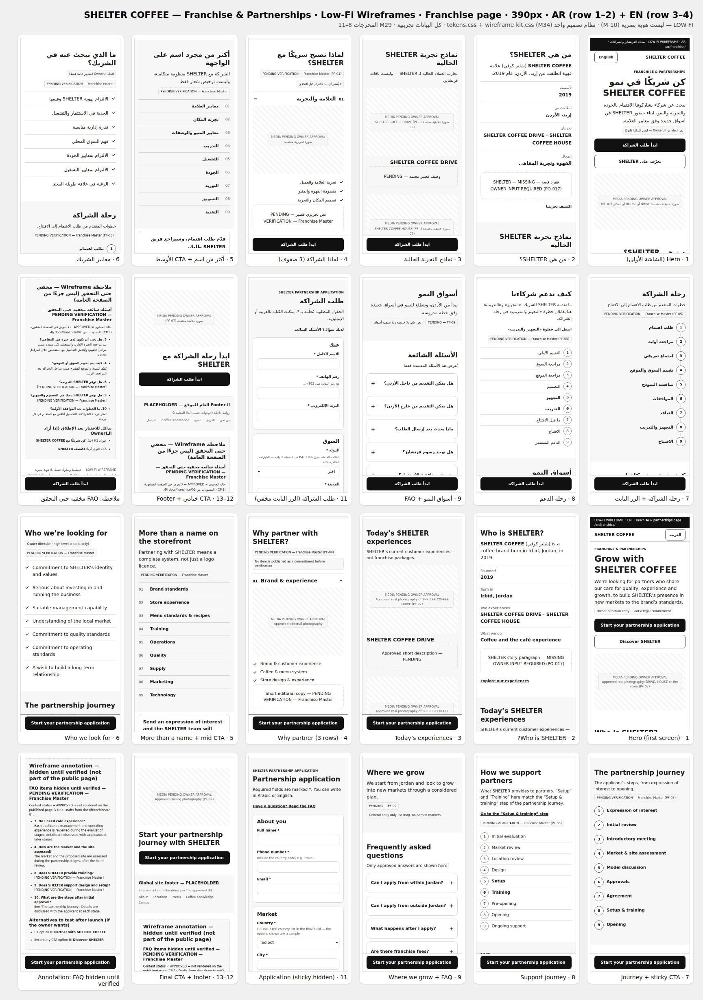
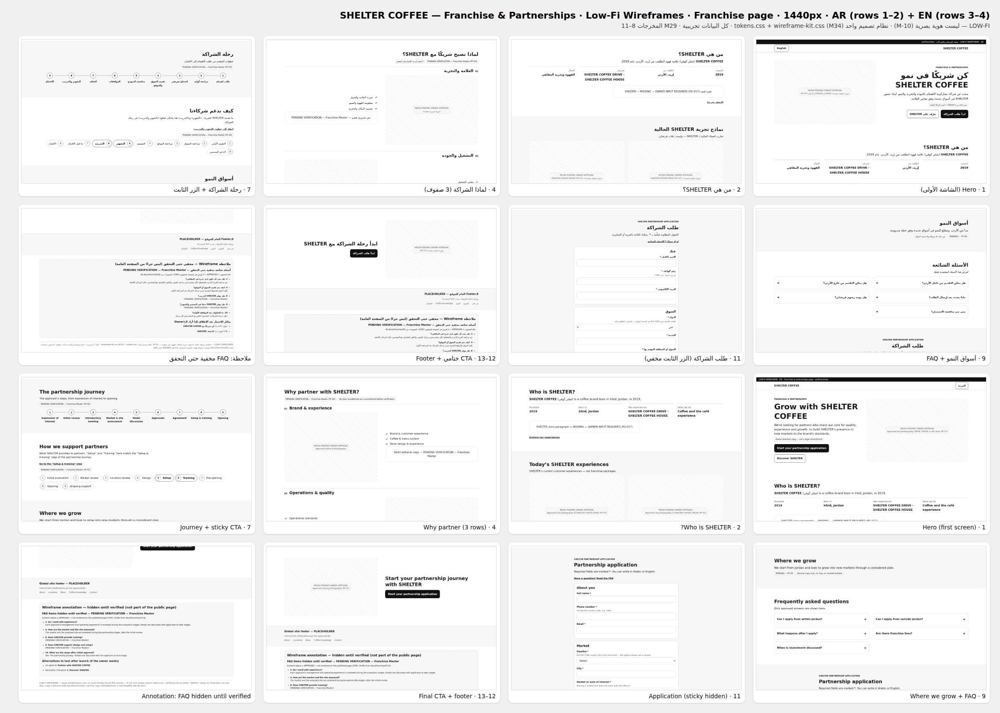
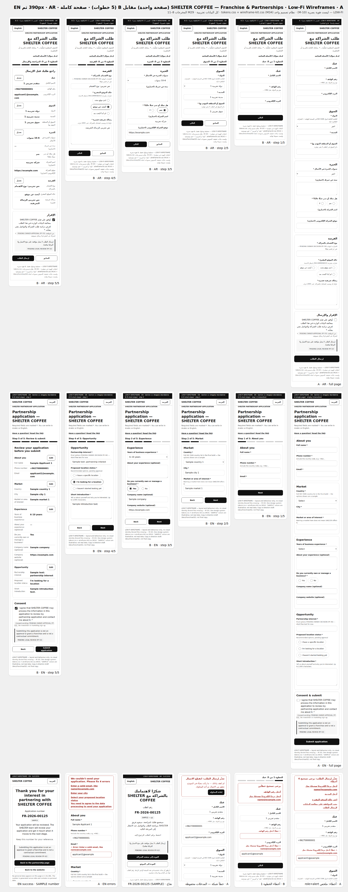
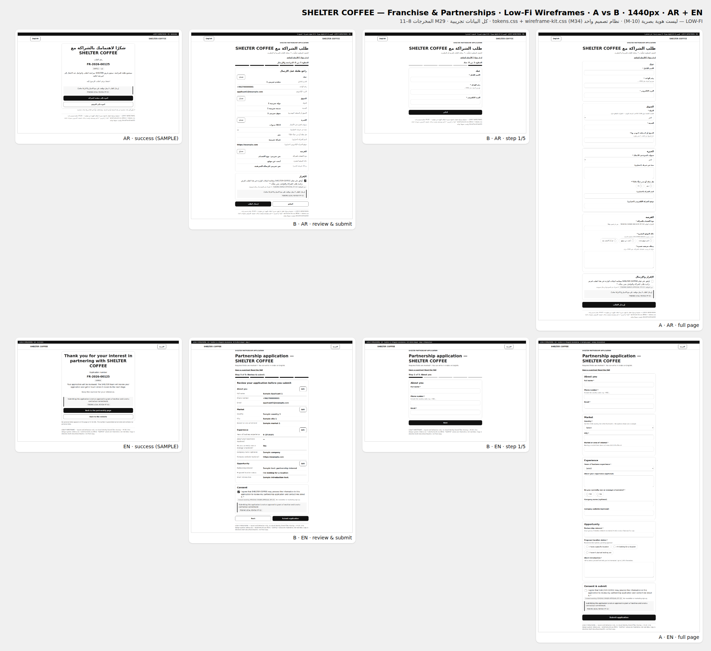
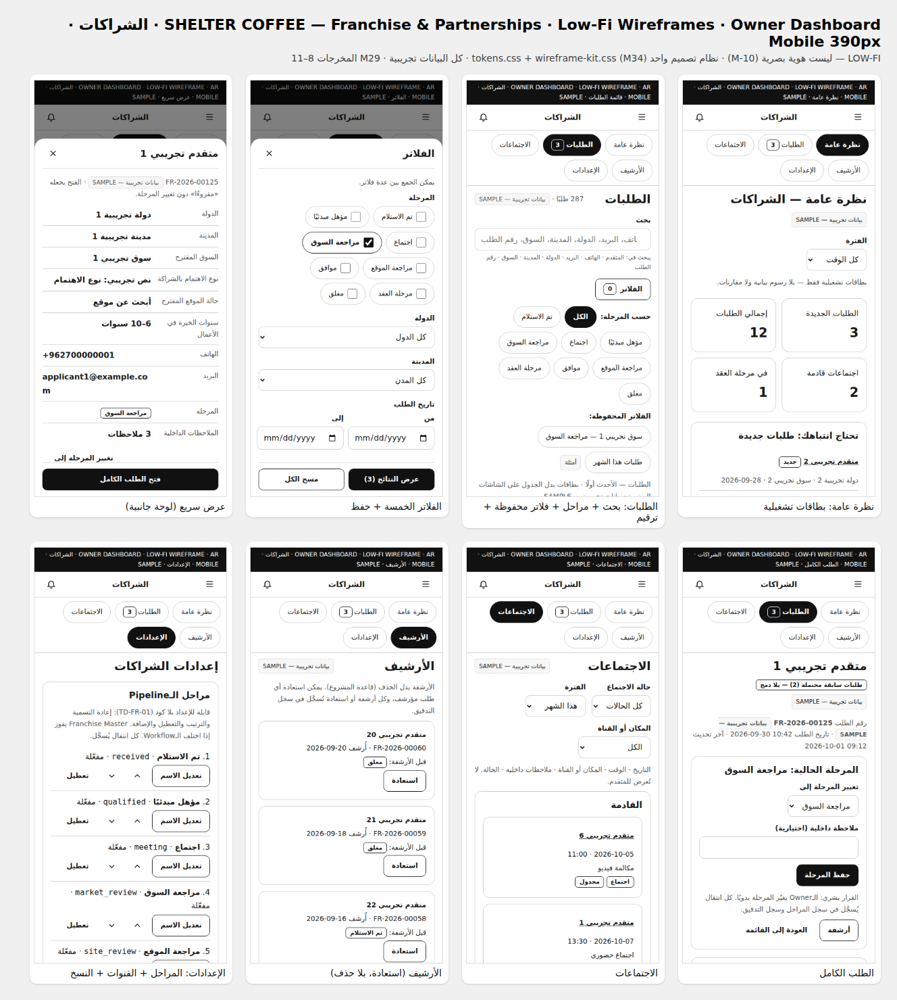
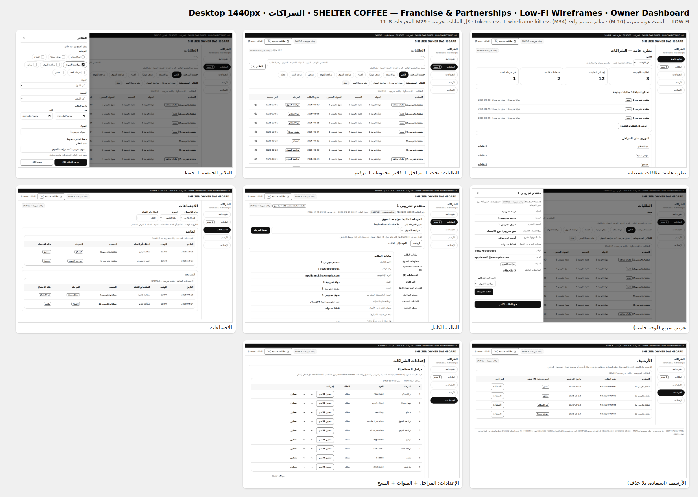

# Low-Fi Wireframes — Franchise & Partnerships (M29 · المخرجات 8–11 + النموذج + وحدة الـDashboard)

> **LOW-FI:** تخطيط وسلوك فقط. لا شعار، ولا ألوان أو خطوط هوية — ملفات الهوية غير متوفرة (M-10).
>
> **المصادر:** مواصفة الـOwner M29 (FRANCHISE / PARTNERSHIP)، وقرار M30 (الـDashboard للـOwner فقط في V1، بلا كود)، وقاعدة M34 (نظام تصميم واحد). المحتوى والحقول من [`../02-PAGE-IA-AND-CONTENT.md`](../02-PAGE-IA-AND-CONTENT.md) و[`../03-APPLICATION-FIELD-MATRIX.md`](../03-APPLICATION-FIELD-MATRIX.md) و[`../04-DASHBOARD-MODULE-IA.md`](../04-DASHBOARD-MODULE-IA.md) حرفيًا.
>
> **البيانات:** الحقائق المعتمدة فقط (SHELTER COFFEE / شلتر كوفي · تأسست 2019 · إربد، الأردن · SHELTER COFFEE DRIVE · SHELTER COFFEE HOUSE). كل ما عداها **عيّنة / SAMPLE** (مثل «متقدم تجريبي 1»، `FR-2026-00125`، `example.com`، «دولة تجريبية 1») أو مُعلَّم بحالته (`PENDING VERIFICATION — Franchise Master` · `MEDIA PENDING OWNER APPROVAL` · `PENDING LEGAL REVIEW`).
>
> **التصفح:** افتح [`html/index.html`](html/index.html). طريقة التوليد في [`tools/`](tools/).

## الأوراق المجمّعة
| الصفحة — 390px (AR ثم EN) | الصفحة — 1440px (AR ثم EN) |
|---|---|
|  |  |

| A مقابل B — 390px (صفحة كاملة) | A مقابل B — 1440px |
|---|---|
|  |  |

| Owner Dashboard · الشراكات — Mobile 390px | Owner Dashboard · الشراكات — Desktop 1440px |
|---|---|
|  |  |

## قرار A/B: صفحة واحدة أم خطوات قصيرة؟
فوّض الـOwner القرار للاختبار (M29 §33): «اختبر Single Structured Form مقابل Short Multi-step Form … **اختر الأقل Friction**».

| | |
|---|---|
| **Decision** | **A — صفحة واحدة منظمة** (5 مجموعات بعناوين: عنك · السوق · الخبرة · الفرصة · الإقرار والإرسال) مع ملخص أخطاء في الأعلى يأخذ التركيز. **هذا هو النموذج المضمَّن في الصفحة** (`PAGE_VARIANT = 'A'` في `tools/build.py`). B (5 خطوات) يبقى جاهزًا كبديل مختبَر. |
| **Reason** | A أقل احتكاكًا في **كل** نقاط القياس الست (3 عروض × لغتين): **13 تفاعلًا مقابل 17** (B يضيف 4 ضغطات «التالي»)، ومجموع الجهد (تفاعلات + شاشات تمرير) أقل بـ 2.6–2.8. كلفة A الوحيدة تمرير أكثر (≈ +1.2 إلى +1.4 شاشة)، لكن النموذج قصير (11 حقلًا مطلوبًا) فلا يعوّض B ذلك. خطوة B الأخيرة (المراجعة والإرسال) هي الأطول (2.05–2.76 شاشة). الخطأ الأول ظاهر بلا تمرير في الاثنين. |
| **Test** | `tooling/tests/prototype/franchise.spec.mjs` → «A/B measurement». نفس الحقول ونفس الترتيب ونفس المقدمة، صفحتا `ar-form-a/b` و`en-form-a/b`، المسار السعيد = 11 حقلًا مطلوبًا + الموافقة (الاختيارية متروكة)، على 360 و390 و430. «التمرير» = أقل تمرير لإظهار كل حقل + أي تمرير سببه الإجراء نفسه؛ تمرير الصفحة البرمجي (تغيير الخطوة، تركيز الملخص) غير محسوب. النتائج الخام: [`evidence/form-variant-measure.json`](evidence/form-variant-measure.json). |
| **Result** | انظر الجدول. **A أقل جهدًا في 6/6.** |

| القياس (390×844) | A — صفحة واحدة (AR · EN) | B — 5 خطوات (AR · EN) |
|---|---|---|
| طول الصفحة (شاشات) | 3.41 · 3.47 | لكل خطوة: 1.14 / 1.19 / 1.38 / 1.41 / **2.45** · 1.13 / 1.20 / 1.40 / 1.46 / **2.59** |
| التفاعلات حتى الإرسال | **13** | 17 (+4 «التالي») |
| التمرير اللازم (شاشات) | 2.31 · 2.33 | **0.91 · 1.04** |
| **مجموع الجهد** (تفاعلات + تمرير) | **15.31 · 15.33** | 17.91 · 18.04 |
| إرسال فارغ: التمرير قبل أول ملاحظة | 2.41 · 2.47 شاشة؛ الملخص 12 خطأ (0.74 · 0.75 شاشة)، ظاهر ومُركَّز | 0 شاشة؛ 3 أخطاء (0.23 شاشة) |
| خطأ واقعي (المدينة فارغة فقط) | يُكتشف عند الإرسال؛ الملخص (خطأ واحد) ظاهر ومُركَّز | يُكتشف في الخطوة 2 |

**على العروض الأخرى** (الجهد A مقابل B):
- **360×800:** AR 15.49 مقابل 18.10 · EN 15.51 مقابل 18.21 (تمرير A 2.49–2.51، B 1.10–1.21).
- **430×932:** AR 14.89 مقابل 17.61 · EN 14.93 مقابل 17.73 (تمرير A 1.89–1.93، B 0.61–0.73).

**متى نعيد الاختبار:** بعد الإطلاق عبر أحداث privacy-safe (`franchise_form_start` / `franchise_form_step` / `franchise_form_submit` / `franchise_form_error` — `05` §2). إذا ظهر تسرب واضح قبل الإرسال، يُختبر B مع مستخدمين حقيقيين؛ نسخته جاهزة هنا بنفس الحقول.

> **حدود القياس:** قياس آلي (Playwright)، وليس اختبار مستخدمين. لوحة المفاتيح الافتراضية غير محسوبة. وزن «ضغطة = شاشة تمرير» اختيار منهجي معلن.

## الصفحة: الـIA المطبّقة (`02` §1 حرفيًا)
صفحة واحدة لكل لغة (`ar-franchise.html` RTL · `en-franchise.html` LTR)، **Mobile-first**، تعمل من 320 إلى 2560px، وحاوية بعرض أقصى 1280px (`--container-page`) فلا يمتد النص عبر 1920px.

| # | القسم | الموبايل | الديسكتوب (≥ 1024) | الحالة الظاهرة |
|---|---|---|---|---|
| 1 | Hero: `FRANCHISE & PARTNERSHIPS` + **H1 (أ)** «كن شريكًا في نمو SHELTER COFFEE» / «Grow with SHELTER COFFEE» + جملة الـOwner + CTA أساسي «ابدأ طلب الشراكة» + ثانوي «تعرّف على SHELTER» | أقصر: نص ثم صورة، والـCTA في الشاشة الأولى (حتى 320×568) | Split غير متماثل 5:6 | الصورة `MEDIA PENDING OWNER APPROVAL` (PF-07) · الجملة «نص اتجاه — ليس التزامًا قانونيًا» |
| 2 | من هي SHELTER؟ — جملة كيان + 4 حقائق معتمدة | قائمة عمودية | سطر حقائق أفقي (4) | فقرة القصة `MISSING — OWNER INPUT REQUIRED (PO-017)` |
| 3 | نماذج تجربة SHELTER الحالية (DRIVE / HOUSE) | بطاقتان متتاليتان | صورتان متجاورتان | «الحالية — وليست باقات فرنشايز» · الوصف PENDING |
| 4 | لماذا تصبح شريكًا — **3 صفوف تحريرية** (3 بنود لكل صف)، وليست 9 بطاقات | Accordion، الأول مفتوح | صفوف Split متناوبة، كلها مفتوحة | `PENDING VERIFICATION — Franchise Master` (PF-04) |
| 5 | أكثر من مجرد اسم على الواجهة (9 عناصر المنظومة) | قائمة مرقمة | شبكة 3×3 مرقمة | PENDING VERIFICATION |
| — | CTA منتصف الصفحة | زر بعرض كامل | شريط هادئ | — |
| 6 | ما الذي نبحث عنه في الشريك؟ (7 معايير عامة) | قائمة | عمودان | اتجاه الـOwner + PENDING VERIFICATION |
| 7 | رحلة الشراكة (9 خطوات) | Timeline عمودي | **Timeline أفقي** | PENDING VERIFICATION (PF-05) |
| 8 | كيف ندعم شركاءنا (9 مراحل) + رابط لخطوة «التجهيز والتدريب» | قائمة | شريط مراحل مضغوط | PENDING VERIFICATION (PF-05) |
| 9 | أسواق النمو — نص عام فقط | نص | نص | `PENDING — PF-09` · **بلا خريطة وبلا تسمية أسواق** |
| 10 | الأسئلة الشائعة — **المعتمدة فقط** (1، 2، 5، 6، 7) | Accordion (details/summary) | عمودان | الأسئلة 3، 4، 8، 9، 10 **خارج `<main>`** في ملاحظة «مخفي حتى التحقق» |
| 11 | طلب الشراكة (النموذج A) | — | عمود قراءة 720px | نص الموافقة PENDING (PF-03) · الـDisclaimer `PENDING LEGAL REVIEW` (PF-02) |
| 12 | CTA ختامي «ابدأ رحلة الشراكة مع SHELTER» | | Split مع صورة | صورة PENDING |
| 13 | Footer | PLACEHOLDER + الروابط الداخلية (`05` §1) | | |

**الـCTA (`02` §5، UX-F-03):**
- «ابدأ طلب الشراكة» في 3 مواضع فقط: Hero · المنتصف · الختام.
- **زر ثابت تحت 1024px:**
  - يظهر **بعد** تجاوز الـHero.
  - يختفي عندما يكون أي جزء من قسم النموذج على الشاشة.
  - ويختفي فوق شريط المنتصف والختام، حتى لا يظهر CTA أساسيان في شاشة واحدة.
  - الصفحة تحجز مكانه (`padding-bottom`)، و`scroll-padding-bottom` يمنع تغطية العنصر المُركَّز.
  - ومع Safe area.

## النموذج (`03` — حقول V1)
| المجموعة / خطوة B | الحقول (رقم المصفوفة) |
|---|---|
| عنك | الاسم الكامل (1) · رقم الهاتف (2) · البريد الإلكتروني (3) |
| السوق | الدولة (4 — قائمة ISO 3166؛ الظاهر عيّنة) · المدينة (5) · السوق أو المنطقة المهتم بها (6 — «ذكر السوق لا يعني توفره») |
| الخبرة | سنوات الخبرة في الأعمال (8 — قائمة) · نبذة عن خبرتك (8، اختياري) · هل تملك أو تدير عملًا حاليًا؟ (9) · اسم الشركة (12، اختياري) · موقع الشركة (13، اختياري) |
| الفرصة | نوع الاهتمام بالشراكة (7 — نص حر مؤقتًا، الخيارات PENDING PF-06) · حالة الموقع المقترح (10 — خيارات RECOMMENDED) · رسالة تعريفية قصيرة (11، حتى 2000 حرف) |
| الإقرار والإرسال / المراجعة والإرسال | الموافقة (Checkbox واحد، النص PENDING PF-03) · الـDisclaimer (PENDING LEGAL REVIEW) · لا اشتراك تسويقي |

- **غير معروض في V1:** القدرة الاستثمارية (14 — PENDING OWNER DECISION) والمرفقات (15).
- **B:** عنك ← السوق ← الخبرة ← الفرصة ← المراجعة والإرسال. خطوة المراجعة تعرض الإجابات مع زر «تعديل» لكل خطوة.
- **الحالات:** ملخص أخطاء `role="alert"` يأخذ التركيز، روابطه تنقل التركيز للحقل. الخطأ الداخلي = نص «خطأ:» / «Error:» + إطار، وليس لونًا فقط. خطأ الشبكة يحفظ كل المدخلات مع «إعادة المحاولة».
- **صفحة النجاح:** «شكرًا لاهتمامك بالشراكة مع SHELTER COFFEE» + `FR-2026-00125` **مع علامة SAMPLE** + «سيخضع طلبك للمراجعة» + جملة الـOwner. **بلا** مدة رد، ولا موافقة، ولا اجتماع، ولا حق امتياز.

## الشاشات
| الملف | الحالة |
|---|---|
| `ar-franchise.html` · `en-franchise.html` | الصفحة الكاملة (A مضمَّن، تفاعلي) |
| `{ar,en}-form-a.html` · `-errors` · `-network` | A منفردًا: فارغ تفاعلي · أخطاء بعد الإرسال · خطأ شبكة |
| `{ar,en}-form-b.html` · `-s2…-s5` · `-errors` · `-network` | B: الخطوات 1–5 · أخطاء الخطوة 1 · خطأ شبكة في خطوة الإرسال |
| `{ar,en}-success.html` | النجاح (رقم عيّنة) |

**Owner Dashboard · «الشراكات» (عربي RTL):** `d-*` لعرض ≥ 1024px و`m-*` لما دونه.
- **نظرة عامة:** 4 بطاقات تشغيلية + طلبات جديدة + التوزيع على المراحل + الدول/المدن/الأسواق المطلوبة (جدول بسيط) + الاجتماعات القادمة. بلا رسوم بيانية.
- **الطلبات:**
  - الأعمدة: المتقدم · الدولة · المدينة · السوق المقترح · تاريخ الطلب · المرحلة · آخر تحديث.
  - البحث في 7 حقول، وشرائح «حسب المرحلة»، وفلاتر محفوظة.
  - ترقيم تقليدي وعدد الصفوف 25/50/100.
  - الموبايل يعرض بطاقات.
- **الفلاتر:** المرحلة · الدولة · المدينة · تاريخ الطلب · السوق، مع حفظ.
- **عرض سريع:** لوحة جانبية على الديسكتوب، وSheet على الموبايل.
- **الطلب الكامل:**
  - البيانات + الموافقة ونسختها.
  - المرحلة (تغيير يدوي + ملاحظة).
  - معلومات السوق.
  - ملاحظات متعددة (الكاتب + الوقت، بلا استبدال صامت).
  - اجتماعات (التاريخ · الوقت · المكان أو القناة · ملاحظات داخلية · الحالة).
  - المرفقات «disabled in V1».
  - الإسناد (Attribution) · سجل المراحل · الطلبات السابقة (تطابق بلا دمج).
  - سجل التدقيق (Actor · Action · Target · Timestamp · Before · After).
- **الاجتماعات · الأرشيف** (استعادة، بلا حذف).
- **الإعدادات:**
  - جدول مراحل الـPipeline قابل للإعداد (9 مراحل بأكوادها — TD-FR-01).
  - أماكن وقنوات الاجتماعات.
  - نسخ نص الموافقة والـDisclaimer.
- **غير موجود عمدًا:** إدارة مستخدمين أو أدوار (V1 = الـOwner فقط — M30)، وأي قبول أو رفض أو تقييم آلي (M29 §44).

## نظام التصميم (M34 — نظام واحد)
- **في كل صفحة:** `design-system/build/tokens.css` ثم `design-system/wireframe-kit.css`، يُقرآن وقت التوليد ويُضمَّنان كما هما، ثم طبقة الصفحة `PAGE_CSS`.
- **طبقة الصفحة:** تخطيط فقط، وتستخدم `var(--…)` حصرًا: بلا px لأحجام الخط والـRadius والمسافات، وبلا ألوان Hex/RGB.
- **مكونات الـKit المستخدمة:**
  - الأزرار: `.ds-btn` + `--primary/--outline/--ghost/--link/--icon/--lg`.
  - الحقول: `.ds-field/.ds-label/.ds-input/.ds-select/.ds-textarea/.ds-help/.ds-error/.ds-field--error/.ds-check`.
  - العناصر: `.ds-chip` · `.ds-badge` · `.ds-card` · `.ds-media` · `.ds-table` · `.ds-alert--danger` · `.ds-empty` · `.ds-sheet` · `.ds-overlay` · `.ds-container` · `.ds-reading` · `.wf-note`.
- **Primitives غير موجودة في الـKit، بُنيت في طبقة الصفحة من الـTokens فقط** (مرشّحة للـKit):

  | Primitive | الاستخدام |
  |---|---|
  | `.acc` | رأس Accordion (نمط APG): «لماذا الشراكة» على الموبايل، و`aria-disabled` على الديسكتوب |
  | `.qa` | Disclosure عبر `details/summary` داخل `.ds-card` (الـFAQ) |
  | `.fr-drawer` | لوحة جانبية للديسكتوب (عرض سريع، فلاتر) |
  | `.dlg-h` / `.dlg-f` | رأس وتذييل ثابتان داخل `.ds-sheet` والـDrawer |
  | `.tl` | Timeline: عمودي ← أفقي |
  | `.stages` | شريط مراحل |
  | `.sticky` | شريط CTA ثابت |
  | `.opts .ds-chip{white-space:normal}` | خيارات Radio طويلة على 320px |

- **`ds-audit` (franchise):** **0** أحجام خط · **0** Radius · **0** مسافات خارج الـScale.
  - **الألوان: 4** قيم `rgb()`، كلها من الملفين المشتركين وليست من صفحات الفرنشايز:
    - 3 Tokens ظلال في `tokens.css`.
    - Overlay في `wireframe-kit.css`.
  - **أسماء الأزرار:** 10، كلها من الـKit (`.ds-btn*`).

## اختيارات تقنية داخل الـWireframes (ليست قرارات Business)
- **`<bdi>`:** كل مقطع لاتيني داخل نص عربي (مثل `(PF-07)` أو `SHELTER COFFEE DRIVE`) يُلفّ بـ`<bdi>`، حتى لا ينكسر الاتجاه.
- **الدول:** القائمة الكاملة ISO 3166 في البناء النهائي. الظاهر 3 خيارات عيّنة.
- **الترقيم الافتراضي 50:** نفس وحدة التوظيف (Applications Core — TD-AC-01).
- **أماكن وقنوات الاجتماعات:** «مكالمة فيديو · مكالمة هاتفية · اجتماع حضوري» أمثلة قابلة للتعديل من الإعدادات.
- **السكربتات:** مساعدات نموذج أولي فقط (الزر الثابت، الـAccordion، فحص الحقول، الخطوات)، وليست كود إنتاج.
- **`prefers-reduced-motion`:** محترم، ولا حركة في الـLow-fi.

## ما زال معلّقًا (لا يُخترع)
| البند | الحالة |
|---|---|
| كل صور الصفحة (Hero، DRIVE، HOUSE، الصفوف التحريرية، الختام) | `MEDIA PENDING OWNER APPROVAL` (PF-07) |
| فقرة قصة SHELTER · وصف DRIVE/HOUSE | `MISSING — OWNER INPUT REQUIRED` (PO-017) / PENDING |
| لماذا الشراكة · المنظومة · المعايير · رحلة الشراكة · رحلة الدعم | `PENDING VERIFICATION — Franchise Master` (PF-01، PF-04، PF-05) |
| أسواق النمو | `PENDING — PF-09` (نص عام فقط) |
| أسئلة FAQ رقم 3، 4، 8، 9، 10 | مخفية حتى التحقق (ملاحظة خارج `<main>`) |
| خيارات «نوع الاهتمام بالشراكة» | PENDING OWNER DECISION (PF-06) — نص حر مؤقتًا |
| نص الموافقة · الـDisclaimer | PENDING (PF-03) · `PENDING LEGAL REVIEW` (PF-02) |
| القدرة الاستثمارية · المرفقات | غير معروضة في V1 (PENDING OWNER DECISION) |
| مراحل الـPipeline النهائية | مقترحة (M29 §38)، Franchise Master يفوز |
| Footer الموقع | PLACEHOLDER |

## التوليد والاختبار
```bash
cd docs/franchise/wireframes/tools
python3 build.py      # → ../html (41 صفحة، deterministic؛ يقرأ tokens.css + wireframe-kit.css)
node sheets.cjs       # → ../png/SHEET-*.png (يستخدم @playwright/test من tooling/)
cd ../../../../tooling
npx playwright test tests/prototype/franchise.spec.mjs   # يكتب أيضًا ../evidence/form-variant-measure.json
node scripts/ds-audit.mjs                                # → docs/DESIGN-SYSTEM-HEALTH.md
```

**ما يُفحص في كل صفحة × كل Viewport** (`tooling/viewports.mjs`، 20 عرضًا):
- `lang`/`dir`.
- `h1` واحد، وأول عنوان هو `h1`، ولا قفز في مستويات العناوين.
- لا تجاوز أفقي، ولا قص للنص، ونص ≥ 12px.
- أهداف اللمس ≥ 44px على العروض اللمسية.
- كل حقل له Label.
- الـDialog داخل الشاشة: زر الإغلاق ≥ 44px، والتذييل ظاهر.
- على ≥ 1440px لا يتجاوز أي نص عرض الحاوية.
- axe WCAG 2.2 AA بلا Serious/Critical.

**السلوك:**
- الزر الثابت: يظهر بعد الـHero، ويختفي داخل النموذج وفوق شريط المنتصف، ولا يظهر على الديسكتوب.
- الـCTA وتبديل اللغة.
- الـAccordion.
- الـFAQ المعتمد فقط.
- ملخص الأخطاء: A، وB، والصفحة.
- خطأ الشبكة.
- `getByLabel` لكل حقل (AR + EN).

**عقد المحتوى (كل الصفحات):**
- لا: مضمون · أفضل فرنشايز · فرصة العمر · أرباح · guaranteed · best franchise · ادعاءات التفوق · 2018 · «منذ 2022».
- لا «5 أيام» ولا أي وعد بمدة رد.
- لا عملات، ولا مصطلحات مالية.
- لا «متاح / حصري / مفتوح / محجوز» في أسواق النمو.
- `FR-2026-00125` لا يظهر إلا بجانب علامة SAMPLE.
- لا صور.

**عقد البنية:**
- ترتيب الـIA، ونص الـH1.
- 3 مواضع للـCTA الأساسي.
- 3 صفوف «لماذا».
- 7 معايير، و9 خطوات للرحلة.
- مصفوفة الحقول (1–11 مطلوبة، 12–13 اختيارية، لا 14/15).
- خطوات B الخمس.
- صفحة النجاح.
- عقد الـDashboard (`04`).
