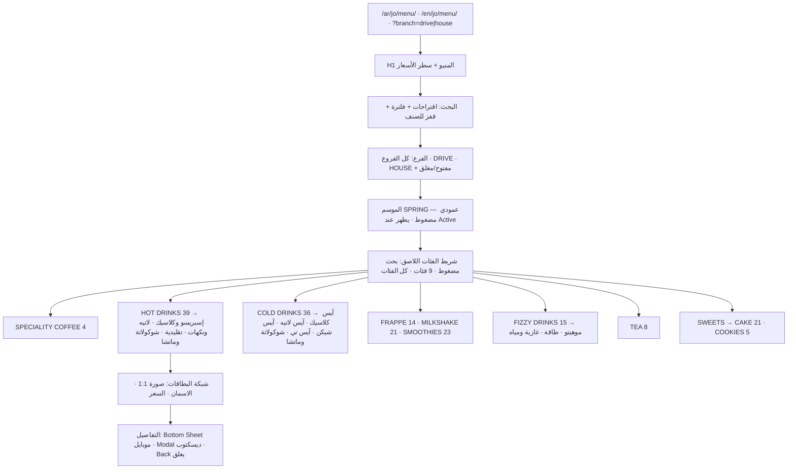
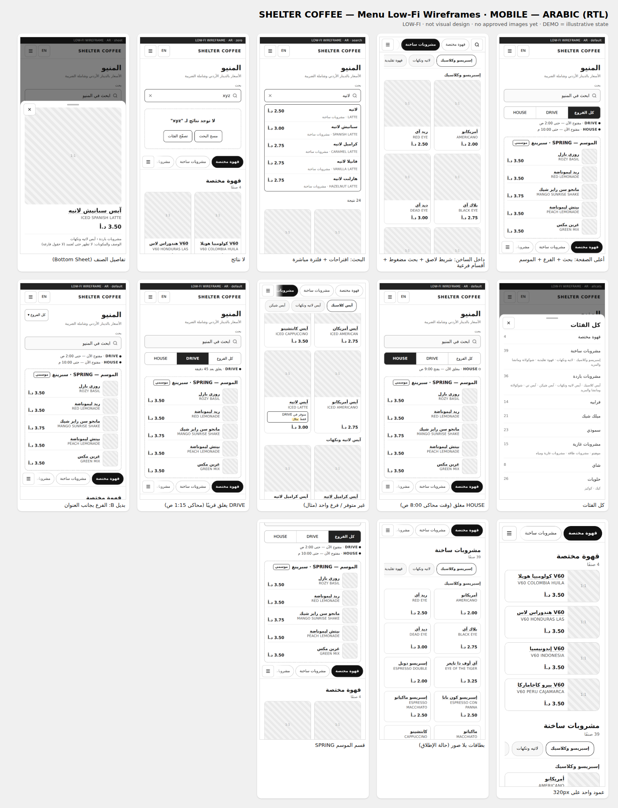
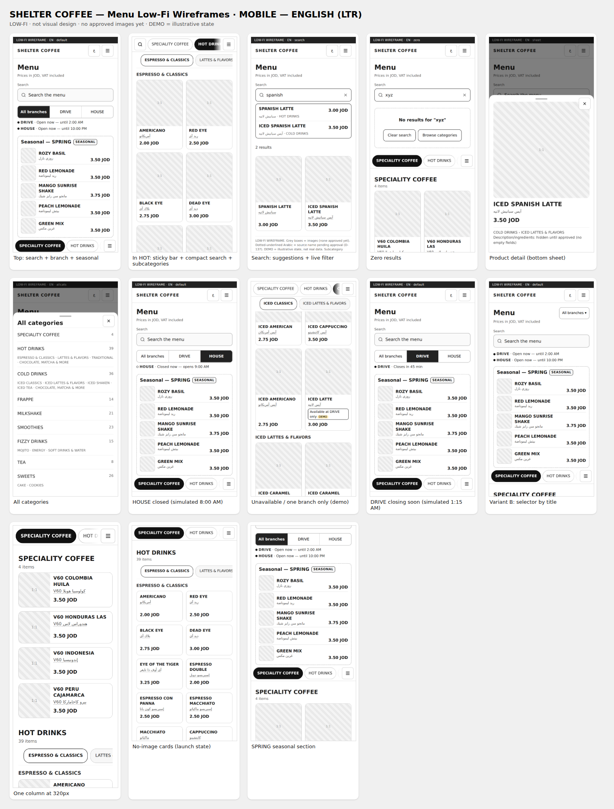
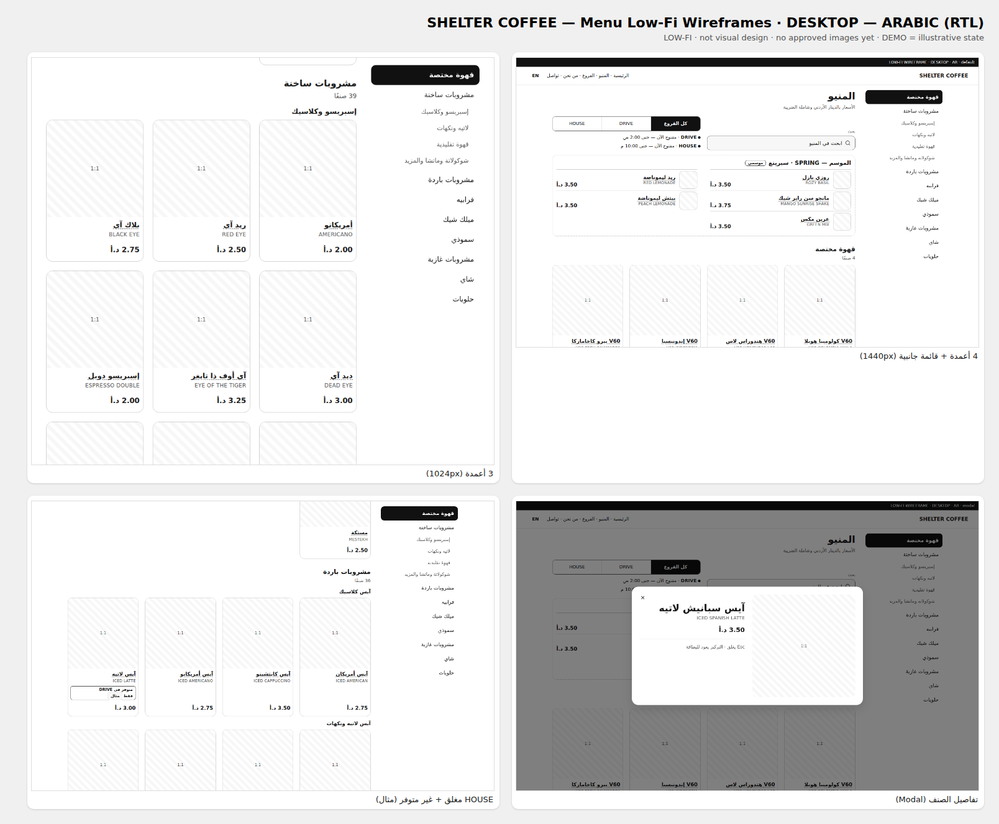
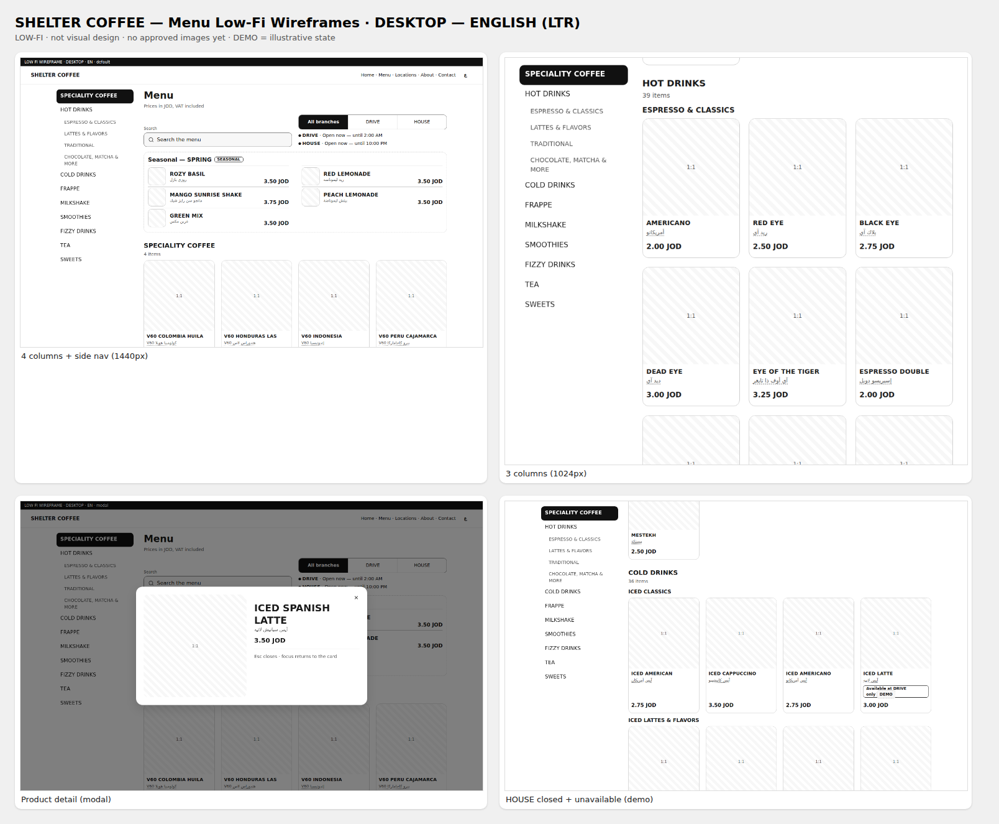

# SHELTER COFFEE — MENU IA / UX / WIREFRAMES — العرض النهائي

> **الحالة:** `READY FOR OWNER REVIEW` · **آخر تحديث:** 2026-10-01
> **المرجع:** الموجز الموحّد (D-142).
> **لم يبدأ:** Visual Design ولا Production Code.
> **بانتظار موافقتك.**

## 1. Executive Summary
- **البنية:** المنيو صفحة واحدة سريعة لكل لغة (`/ar/jo/menu/` و`/en/jo/menu/`)، وفيها كل الأصناف الـ191 كنص في الـHTML.
- **التنقل:** شريط فئات لاصق، وأقسام فرعية في الساخن والبارد والغازي، وبحث بلغتين، ومحدد فرع مع حالة مفتوح/مغلق حقيقية.
- **الـWireframes:** صُممت واختُبرت فعليًا على 11 عرض شاشة بالعربي والإنجليزي ببيانات المنيو الحقيقية. **تحديث:** المصفوفة الإلزامية الآن 14 عرضًا + Landscape + تكبير 200% (D-217)، وأُعيد الفحص الآلي عليها كاملة (Chromium فقط): [`../qa/RESPONSIVE-QA-MATRIX.md`](../qa/RESPONSIVE-QA-MATRIX.md).
  - **5 مشاكل P0 اكتُشفت وصُححت قبل هذا العرض:** أهداف لمس صغيرة، عمودان غير مقروءين على 320px، التابلت، إيحاء بتوفر غير معروف، أسماء عربية غير معتمدة.
- **منطق الساعات** (بعد منتصف الليل، يغلق قريبًا، الاستثناءات) مُتحقق منه: **12/12**.
- **ثلاثة أمور تمنع الإطلاق** (لا هذه المرحلة):
  1. **الأسماء العربية:** 152 اسمًا بانتظار المراجعة.
  2. **التوفر حسب الفرع:** غير معروف.
  3. **الصور المعتمدة:** صفر.
- **ما يمنع مرحلة الـVisual Design:** ملفات الهوية (الشعار، الألوان، الخطوط) غير موجودة في المشروع.

## 2. Frozen decisions confirmed
**23 قرارًا مجمّدًا** (F-01 → F-23) في [`MENU-DECISION-REGISTER.md`](MENU-DECISION-REGISTER.md) §1، ولم يُفتح أي منها. أبرزها:
- 191 صنفًا، و`PRD-00120` مدموج في `PRD-00115`.
- `MV-2026-10-01`، والأسعار شاملة الضريبة بالفلس.
- SPECIALITY COFFEE، وترتيب العرض، وSWEETS، وSPRING أعلى المنيو.
- Hybrid بلا صفحات أصناف.
- لا Favorites، ولا زر مشاركة، ولا Add-ons.

## 3. Conflicts found
**11 تعارضًا موثقًا** (CF-01 → CF-11)، ولم يُغيّر أي قرار بصمت. الأهم:

| # | التعارض | المعالجة |
|---|---|---|
| CF-01 | الشبكة بالصور (الموجز) مقابل صفوف مضغوطة (الدراسة السابقة) | اتُّبع الموجز. **التمرير مع الصور 36.7–40 شاشة** مقابل نحو 19 بلا صور. معالجة بالتنقل والبحث |
| CF-02 | محدد الفرع بينما التوفر `UNKNOWN` | يعرض الساعات والحالة فقط. **لا "متوفر/غير متوفر" ولا فلترة قبل البيانات** |
| CF-03 | مثال البطاقة يعرض اسمًا عربيًا غير معتمد | الإنتاج يعرض المعتمد فقط، والإنجليزي بديل |
| CF-11 | "استخدم الهوية الموجودة في المشروع"، ولا يوجد ملف هوية | لا نختار ألوانًا أو خطوطًا من عندنا |

## 4. Remaining missing business data

| الأولوية | البيانات |
|---|---|
| **قبل الـVisual Design** | الشعار Vector · الألوان · الخطوط · دليل الهوية (M-10) |
| **قبل إطلاق الصفحة العربية** | مراجعة 152 اسمًا عربيًا + 9 فئات (P-01) |
| **قبل تفعيل قيمة محدد الفرع** | التوفر لكل صنف في DRIVE وHOUSE: 382 قيمة (M-01) |
| **قبل الإطلاق بصور** | صور معتمدة. الإطلاق ممكن ببطاقات نصية |
| **عند توفرها** | بيانات Cold Brew · Lotus Cheesecake · Ice Cream · Single Espresso · تواريخ SPRING · الأوصاف والمكونات · Snacks/Pastries · الكاشير |
| **نصوص للاعتماد** | أسماء الأقسام الفرعية (12) · سطر "الأسعار شاملة الضريبة" · Title/Meta · قاموس البحث |

القائمة الكاملة: [`MENU-DECISION-REGISTER.md`](MENU-DECISION-REGISTER.md) §2–§3.

## 5. Final Menu IA diagram

## 6–9. Wireframes

**كل الحالات مع روابطها:** [`wireframes/README.md`](wireframes/README.md)

| | Arabic | English |
|---|---|---|
| **Mobile** |  |  |
| **Desktop** |  |  |

## 10. Search UX
- **المكان:** حقل كامل تحت العنوان، ويصبح أيقونة داخل الشريط اللاصق بعد التمرير.
- **أثناء الكتابة:** 5 اقتراحات + فلترة الشبكة + "N نتيجة" معلنة. ضغط اقتراح يقفز للصنف ويبرزه.
- **بلغتين:**
  - عربي وإنجليزي في الصفحتين.
  - توحيد الحروف العربية وتحمّل خطأ حرف واحد ("سبانش/سبانيش").
  - **لا مرادفات مخترعة.**
- **لا نتائج:** رسالة + مسح + تصفّح الفئات + حدث `zero_result_search`.

التفاصيل: [`SHELTER-MENU-IA-SPEC.md`](SHELTER-MENU-IA-SPEC.md) §8.

## 11. Branch UX
- **الشكل:** `كل الفروع | DRIVE | HOUSE`. **مكانه A** (تحت البحث): نقرة واحدة، والخيارات ظاهرة، والحالة تحتها مباشرة.
- **أولوية اختيار الفرع:** `?branch=` ← المحفوظ على الجهاز ← كل الفروع.
- **تغيير الفرع:** لا يحرّك الصفحة.
- **حالة الفرع:**
  - **التوقيت:** بتوقيت عمّان، وتتحدث كل دقيقة.
  - **العرض:** "مفتوح الآن — حتى 2:00 ص" · "يغلق بعد 45 دقيقة" · "مغلق الآن — يفتح 9:00 ص".
  - **الفرع المغلق** لا يمنع التصفح.
- **التوفر:** 4 حالات في البيانات، لكنها لا تظهر للعميل ما دامت `UNKNOWN`.

## 12. Product detail UX
- **الشكل:** Bottom Sheet على الموبايل، وModal على الديسكتوب. نفس المحتوى ونفس القواعد.
- **المحتوى:** فقط الحقول المعتمدة، ولا حقول فارغة. اليوم: الاسم والسعر (والصورة عند اعتمادها).
- **الإغلاق:** زر · سحب · Back · `Esc`. ويعود المستخدم لنفس المكان.
- **تغيير الفرع والتفاصيل مفتوحة:** متوفر ← يبقى · Show ← يبقى مع "غير متوفر" · Hide ← يُغلق بهدوء.

## 13. Accessibility review
- **ما صُحح:** كل الأهداف ≥ 44px (كانت 17 أقل)، ولا تجاوز أفقي على 320px.
- **في المواصفات:** `lang` للأسماء المختلطة، والسعر مقروء بالعملة، والحالات نصية، والنوافذ بإدارة تركيز كاملة.
- **القائمة الكاملة:** [`ACCESSIBILITY-CHECKLIST.md`](ACCESSIBILITY-CHECKLIST.md)
- **يبقى للمرحلة البصرية:** التباين بألوان العلامة.

## 14. Performance review
- **مقاس:** كل المنيو حوالي 6.5KB HTML مضغوط، وفهرس البحث 4.1KB، والـSchema 1.6KB.
- **الأهداف:** HTML ≤ 35KB · JS خاص بالمنيو ≤ 30KB · خطوط ≤ 120KB · LCP ≤ 2.5s · INP ≤ 200ms · CLS ≤ 0.1.
- **قواعد:** لا Virtualization، بل `content-visibility`. أدوات القياس بعد المحتوى.

التفاصيل: [`PERFORMANCE-BUDGET.md`](PERFORMANCE-BUDGET.md)

## 15. SEO review
- **الصفحات:** صفحة واحدة لكل لغة، كل النص من الخادم.
- **الوسوم:** Canonical نظيف بلا `?branch`، وhreflang `ar-JO` ↔ `en-JO`.
- **الحالة في الرابط:** الأقسام والتفاصيل Hash غير مفهرس، والبحث لا يدخل الرابط.
- **Schema:** `Menu` مختصر بالاسم والسعر فقط. لا تقييمات ولا توفر ولا تغذية.
- **`/menu` القديم:** 301 وقت الإطلاق فقط بعد الفحوص.
- **صفحات الأصناف:** لا صفحات رقيقة. لاحقًا فقط لأصناف لها محتوى حقيقي.

## 16. Analytics plan
- **الأحداث:** `menu_view` · `menu_search` · `zero_result_search` · `menu_category_click` · `product_view` · `branch_filter_change`.
- **Key Events:** لا شيء منها.
- **الخصوصية:** نص البحث منظّف ويُحجب ما يشبه هاتفًا أو بريدًا.
- **تعديل تسمية موثّق:** `menu_item_id` بدل `item_id` لتجنب تعارض GA4.
- **لا تنفيذ على Google الآن.**

التفاصيل: [`MENU-MEASUREMENT-PLAN.md`](MENU-MEASUREMENT-PLAN.md)

## 17. P0 / P1 / P2

| | العدد | الحالة |
|---|---|---|
| **P0** | 5 | **كلها صُححت** (الأدلة قبل وبعد في [`UX-VALIDATION.md`](UX-VALIDATION.md) §2) |
| **P1** | 9 | أهمها: طول التمرير مع الصور · الإطلاق بلا صور · شريطان أفقيان (اختبار مستخدمين) · إعادة القياس بخطوط العلامة · **ملفات الهوية** |
| **P2** | 6 | تحسينات تُراجع بالقياس بعد الإطلاق |

## 18. Final recommendation before Visual Design
1. **اعتماد هذه الـIA والـWireframes** كما هي، مع التعديلات المطبقة (R-01 → R-08).
2. **تسليم ملفات الهوية (M-10)**، وهي **الشرط الوحيد** لبدء الـVisual Design:
   - الشعار Vector.
   - الألوان.
   - الخطوط وترخيصها.
   - أي دليل هوية موجود.
3. **بالتوازي، وبدون أن تمنع الـVisual:**
   - مراجعة الأسماء العربية بمجموعات حسب الفئة.
   - اعتماد أسماء الأقسام الفرعية.
   - بدء جمع التوفر لكل فرع.
   - تخطيط جلسة تصوير **لفئات كاملة**.
4. **بعد الـVisual:** Prototype تفاعلي واختبار سريع مع 5 مستخدمين، خصوصًا الشريطين الأفقيين والبحث، قبل أي Production Code.

**الملفات:**
- [`MENU-DECISION-REGISTER.md`](MENU-DECISION-REGISTER.md)
- [`SHELTER-MENU-IA-SPEC.md`](SHELTER-MENU-IA-SPEC.md)
- [`SUBCATEGORY-PROPOSAL.md`](SUBCATEGORY-PROPOSAL.md)
- [`USER-FLOWS.md`](USER-FLOWS.md)
- [`wireframes/`](wireframes/README.md)
- [`UX-VALIDATION.md`](UX-VALIDATION.md)
- [`PERFORMANCE-BUDGET.md`](PERFORMANCE-BUDGET.md)
- [`MENU-MEASUREMENT-PLAN.md`](MENU-MEASUREMENT-PLAN.md)
- [`ACCESSIBILITY-CHECKLIST.md`](ACCESSIBILITY-CHECKLIST.md)
- [`evidence/`](evidence/)
