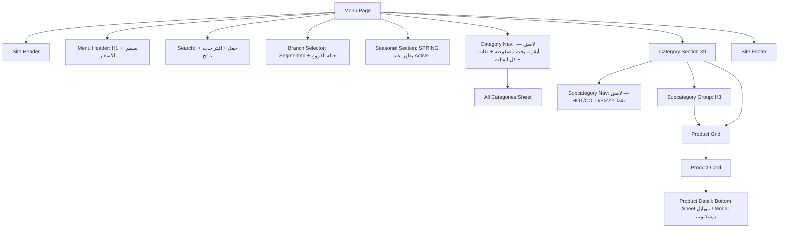

# SHELTER MENU IA SPEC

> **الحالة:** `DRAFT — PENDING OWNER APPROVAL` · **آخر تحديث:** 2026-10-01
> **المرجع:** الموجز الموحّد للـOwner (D-142) + السجل [`MENU-DECISION-REGISTER.md`](MENU-DECISION-REGISTER.md).
> **ما هذا:** مواصفات بنية وسلوك فقط. لا Visual Design ولا Production Code.
> **الأدلة:** [`UX-VALIDATION.md`](UX-VALIDATION.md) · [`evidence/`](evidence/)
> **الـWireframes:** [`wireframes/`](wireframes/README.md)

**المبادئ:**
- **Simplicity wins.**
- كل قرار يخدم: سرعة الوصول للصنف · وضوح السعر · وضوح الفرع · البحث · SEO · Accessibility · Performance.

---

## 1. الصفحة والمسارات

| الصفحة | الرابط | ملاحظات |
|---|---|---|
| المنيو العربي | `/ar/jo/menu/` | `lang="ar" dir="rtl"` · hreflang `ar-JO` |
| المنيو الإنجليزي | `/en/jo/menu/` | `lang="en" dir="ltr"` · hreflang `en-JO` |
| سياق فرع | `?branch=drive` · `?branch=house` | نفس الصفحة. الـCanonical على الرابط النظيف |
| قسم أو صنف | `#hot-drinks` · `#p-iced-spanish-latte` | داخل الصفحة. لا صفحات مستقلة في V1 |
| الرابط القديم | `/menu` ← 301 ← `/ar/jo/menu/` | **وقت الإطلاق فقط** بعد الفحوص (D-054). لا تنفيذ الآن |

**الدخول للمنيو من:**
- زر "المنيو" في الـHeader.
- صفحة DRIVE: `?branch=drive`.
- صفحة HOUSE: `?branch=house`.
- رابط QR القصير `/menu`.
- البحث في Google.

## 2. Component hierarchy

**الديسكتوب (≥1024px):** شريط الفئات الأفقي يُستبدل بقائمة جانبية لاصقة (فئات + أقسام فرعية للقسم الحالي). باقي المكونات كما هي.

## 3. Content hierarchy (من الأعلى للأسفل)

1. **Site Header:** الشعار، تبديل اللغة، القائمة.
2. **H1 "المنيو" / "Menu"** وتحته سطر "الأسعار بالدينار الأردني وشاملة الضريبة" (نص مقترح، P-05).
3. **البحث:** حقل كامل بعنوان ظاهر.
4. **محدد الفرع:** `كل الفروع | DRIVE | HOUSE`، وتحته حالة كل فرع.
5. **قسم الموسم (SPRING):** فقط عندما يكون Active.
6. **شريط الفئات اللاصق.**
7. **الأقسام التسعة بالترتيب المعتمد (F-06):**
   - كل قسم: H2 + عدد الأصناف + شريط فرعي (حيث يلزم) + H3 لكل قسم فرعي + الشبكة.
8. **Footer.**

**هرمية العناوين:** H1 المنيو ← H2 الفئة (والموسم) ← H3 القسم الفرعي ← اسم الصنف كعنصر قائمة.

## 4. الفئات (Category architecture)

| الترتيب | Anchor | فئات المصدر | الاسم EN | الاسم AR | أقسام فرعية |
|---|---|---|---|---|---|
| — (أعلى) | `#spring` | `CAT-009` | SPRING | سبرينغ (`PENDING`) | لا — قسم موسمي |
| 1 | `#speciality-coffee` | `CAT-008` | SPECIALITY COFFEE | قهوة مختصة (`PENDING`) | لا (4 أصناف) |
| 2 | `#hot-drinks` | `CAT-001` | HOT DRINKS | مشروبات ساخنة (`PENDING`) | نعم |
| 3 | `#cold-drinks` | `CAT-002` | COLD DRINKS | مشروبات باردة (`PENDING`) | نعم |
| 4 | `#frappe` | `CAT-006` | FRAPPE | فرابيه (`PENDING`) | لا |
| 5 | `#milkshake` | `CAT-004` | MILKSHAKE | ميلك شيك (`PENDING`) | لا |
| 6 | `#smoothies` | `CAT-005` | SMOOTHIES | سموذي (`PENDING`) | لا |
| 7 | `#fizzy-drinks` | `CAT-003` | FIZZY DRINKS | مشروبات غازية (`PENDING`) | نعم |
| 8 | `#tea` | `CAT-007` | TEA | شاي (`PENDING`) | لا |
| 9 | `#sweets` | `CAT-010` + `CAT-011` | SWEETS | حلويات ✅ | CAKE / كيك ✅ · COOKIES / كوكيز ✅ |

**قواعد:**
- **الـSlug** يُخزّن في الـCMS ثابتًا لكل فئة، ولا يُعاد توليده عند تغيير الاسم.
- **الأسماء العربية للفئات** من المصدر (`PENDING`، P-01) إلى أن تُعتمد. تبقى الإنجليزية (معتمدة كمصدر رسمي) هي البديل.
- **SWEETS** فئة عرض (Display Group) تجمع فئتين، وليست فئة بيانات جديدة.

## 5. الأقسام الفرعية (Subcategory architecture)

- **الكيان:** `subcategory` = طبقة عرض (`DSC-…`) تابعة لفئة. لكل صنف `subcategory_id` اختياري.
- **المقترح والتوزيع:** [`SUBCATEGORY-PROPOSAL.md`](SUBCATEGORY-PROPOSAL.md) و[`subcategory-mapping.csv`](subcategory-mapping.csv).
  - HOT: 4 أقسام. COLD: 5 أقسام. FIZZY: 3 أقسام.
  - 3 أصناف `PENDING OWNER REVIEW`.
- **صنف بلا قسم فرعي معتمد:** يظهر في آخر الفئة تحت مجموعة "المزيد / MORE" إلى أن يُصنّف. لا يُخفى أي صنف.
- **الشريط الفرعي:**
  - لاصق تحت شريط الفئات، ويظهر فقط داخل فئة لها أقسام فرعية.
  - يتحدث تلقائيًا حسب موضع التمرير.

## 6. بطاقة الصنف (Product Card)

| العنصر | العربي | الإنجليزي |
|---|---|---|
| 1. الصورة | 1:1 (فقط إذا كانت `APPROVED`) | نفسها |
| 2. الاسم الأساسي | `display_name_ar` بخط أكبر وعريض | `display_name_en` (ALL CAPS) |
| 3. الاسم الثانوي | `display_name_en` أصغر · `lang="en"` | `display_name_ar` أصغر · `lang="ar"` (فقط إذا كان معتمدًا) |
| 4. السعر | `3.50 د.أ` | `3.50 JOD` |
| شارات (عند الحاجة) | جديد · موسمي | NEW · SEASONAL |
| حالة الفرع (عند الحاجة) | غير متوفر حاليًا · متوفر في DRIVE فقط | Currently unavailable · Available at DRIVE only |

**قواعد البطاقة:**
1. **البطاقة كلها زر واحد** يفتح التفاصيل (`<button>` أو رابط ضمن `<article>`)، ومساحة اللمس هي البطاقة كاملة.
2. **الاسم العربي غير المعتمد (CF-03):** في الإنتاج، إذا لم يوجد `display_name_ar` معتمد:
   - الاسم الإنجليزي يصبح الأساسي في الصفحة العربية.
   - لا يظهر اسم ثانوي.
   - لا نعرض اسم المصدر.
3. **ALL CAPS أسلوب عرض فقط (D-131):**
   - النص يُخزّن بحالة الأحرف المعتمدة.
   - يُختبر مع قارئات الشاشة (VoiceOver وTalkBack وNVDA).
   - إذا قُرئ اسم حرفًا حرفًا، يُضاف له `aria-label` بحالة عادية من الـCMS.
4. **السعر:**
   - رقم واحد بخانتين عشريتين، ويُعزل اتجاهيًا (`<bdi>`).
   - قارئ الشاشة يسمع "3.50 دينار أردني" / "3.50 Jordanian dinars".
   - **لا "+ ضريبة"**، ولا سعر قبل الضريبة.
5. **الأسماء الطويلة تلتف ولا تُقص.** لا Ellipsis.
6. **الشارات:**
   - **الحد:** شارة واحدة كحد أقصى على البطاقة. الأولوية: الموسم ثم جديد.
   - **FEATURED:** لا يظهر للعميل أبدًا.
   - **الشكل:** نص دائمًا، وليس لونًا فقط.
7. **حالة التوفر في الفرع:**
   - تظهر فقط إذا كانت البيانات معروفة ومختلفة بين الفرعين (§9.6).
   - تكون نصًا، والبطاقة تخفت بصريًا مع بقاء السعر مقروءًا.
8. **بطاقة بلا صورة (حالة الإطلاق — M-02):** نص فقط بارتفاع أدنى ثابت، بلا صورة بديلة.
   - **عرض القسم:** إذا كانت كل أصناف القسم بلا صور، يُعرض القسم بالكامل كنص.
   - **قسم مختلط** (صور + بدون): تبقى مساحة الصورة لكل البطاقات بلا رسم بديل. **توصية:** تصوير كل فئة كاملة دفعة واحدة.

## 7. تفاصيل الصنف (Product Detail)

| | موبايل (<1024px) | ديسكتوب (≥1024px) |
|---|---|---|
| الشكل | Bottom Sheet، حتى 86% من الارتفاع، مع مقبض سحب | **Modal** في المنتصف (عرض حتى 760px): صورة 1:1 في جهة، والمعلومات في الأخرى |
| الإغلاق | زر إغلاق (44px) · السحب للأسفل · Back · النقر على الخلفية | زر إغلاق · `Esc` · Back · النقر على الخلفية |
| التركيز | ينتقل إلى عنوان التفاصيل، ويُحبس داخلها، ويعود للبطاقة عند الإغلاق | نفس الشيء |

**المحتوى بالترتيب (يظهر فقط ما هو معتمد، ولا حقول فارغة أبدًا):**
1. الصورة.
2. الاسم الأساسي.
3. الاسم الثانوي.
4. السعر.
5. التوفر حسب الفرع (فقط إذا كان معروفًا).
6. معلومة الموسم (فقط لأصناف موسمية).
7. الوصف.
8. المكونات.
9. الحساسية.

**ملاحظات:**
- اليوم عمليًا: الاسم والسعر والصورة (عند توفرها).
- **سطر الموقع:** "مشروبات باردة › آيس لاتيه ونكهات" ليعرف العميل مكان الصنف.

**الـHistory:**
- فتح التفاصيل يضيف `#p-{slug}` إلى الـHistory (`pushState`). Back يغلقها، ويعود الموضع كما كان.
- فتح رابط فيه `#p-{slug}` مباشرة:
  - يفتح القائمة عند الصنف.
  - ثم يفتح التفاصيل.
  - لا زر مشاركة (CF-04).

**تغيير الفرع والتفاصيل مفتوحة (الموجز §32):**
- **متوفر:** تبقى مفتوحة ويُحدّث سطر التوفر.
- **Unavailable + Show:** تبقى مفتوحة مع "غير متوفر حاليًا في HOUSE".
- **Unavailable + Hide:** تُغلق بهدوء ويعود المستخدم لمكانه في القائمة.

## 8. البحث (Search)

**المكان والشكل:**
- حقل كامل تحت H1 وقبل الفرع.
- بعد تمريره خارج الشاشة يصبح **أيقونة بحث في بداية شريط الفئات اللاصق**. لا شريط بحث لاصق مستقل.
- الضغط على الأيقونة يعيد الحقل ويركّز عليه.

**الفهرس (محلي في الصفحة، حوالي 4KB مضغوطًا):** لكل صنف:
- `display_name_ar` و`display_name_en`.
- `source_name_en` و`source_name_ar`: للبحث فقط، ولا تُعرض.
- `normalized_*`.
- الأسماء البديلة المعتمدة من الـCMS (P-06).
- الفئة والقسم الفرعي.

**التطبيع:**
- إزالة الحركات (التشكيل) والتطويل.
- توحيد أ/إ/آ ← ا، ة ← ه، ى ← ي.
- تحويل الأرقام العربية إلى غربية.
- Lowercase وإزالة الرموز (+ ( ) -).
- مطابقة بداية الكلمات، ثم احتمال خطأ حرف واحد للكلمات من 5 أحرف فأكثر (يلتقط "سبانش/سبانيش"). **لا مرادفات مخترعة.**

**السلوك أثناء الكتابة:**
1. **من الحرف الثاني:** تظهر **حتى 5 اقتراحات** تحت الحقل، لكل اقتراح: الاسم والاسم الثاني والفئة والسعر.
2. **في نفس الوقت تتفلتر الشبكة:**
   - يظهر "N نتيجة" ويُعلن لقارئ الشاشة (`aria-live="polite"`).
   - الأقسام بلا نتائج تختفي مؤقتًا.
3. **الضغط على اقتراح (Jump to Product):**
   - يُغلق الاقتراحات ويمسح الفلتر.
   - ينتقل إلى الصنف في مكانه الطبيعي ضمن القائمة، ويُبرزه بإطار لمدة 1.5 ثانية.
   - **لا يفتح التفاصيل تلقائيًا.**
4. **Enter أو "بحث" في الكيبورد:** يغلق الاقتراحات ويُبقي النتائج المفلترة.
5. **زر المسح (×، 44px):** يمسح ويعيد القائمة كاملة ويعيد التركيز للحقل.

**البحث بلغتين:**
- الصفحة العربية + "Spanish Latte" ← SPANISH LATTE.
- الصفحة الإنجليزية + "سبانيش لاتيه" ← نفس الصنف.
- النتيجة تُعرض بلغة الصفحة.

**بلا نتائج:**
- "لا توجد نتائج لـ "…"" + زر **مسح البحث** + زر **تصفّح الفئات**.
- اقتراح أقرب فئة فقط إذا طابق النص اسم فئة أو قسم فرعي.
- يُرسل `zero_result_search` (§14).
- لا شاشة فارغة.

**ليس في الرابط:** نص البحث لا يدخل الـURL (الموجز §63).

## 9. الفروع (Branch behavior)

### 9.1 المحدد
- **Segmented Control بثلاثة أزرار:** `كل الفروع | DRIVE | HOUSE`.
  - الأزرار `aria-pressed`، والمجموعة `role="group"`.
  - كل زر 44px على الأقل.
- **تحته سطر الحالة:**
  - في "كل الفروع": حالة الفرعين بسطرين.
  - عند اختيار فرع: سطر واحد للفرع المختار.
- **المكان:** الموضع A، تحت البحث وقبل الفئات (R-01، مع الأدلة).
- **فروع أكثر مستقبلًا:** من 4 خيارات فأكثر يتحول المكون إلى زر "الفرع: كل الفروع ▾" يفتح Bottom Sheet بقائمة الفروع وحالتها. **نفس واجهة البيانات.**

### 9.2 أولوية تحديد الفرع
1. `?branch=` في الرابط (قادم من صفحة فرع أو رابط).
2. آخر اختيار محفوظ على الجهاز (`localStorage`، بلا بيانات شخصية).
3. الافتراضي: **كل الفروع**.

"كل الفروع" خيار ظاهر دائمًا، ولا يُقفل العميل على فرع.

### 9.3 تغيير الفرع
- يحدّث `?branch=` بـ`replaceState`، فلا يُضيف خطوة في الـHistory.
- **يحافظ على مكان المستخدم:** لا قفز للأعلى. إذا كان في HOT DRINKS يبقى فيها.
- يُرسل `branch_filter_change`.

### 9.4 حالة الفرع (مفتوح / مغلق)
- **التوقيت:** تُحسب في المتصفح بتوقيت **Asia/Amman** مهما كان توقيت الجهاز، وتُحدّث كل دقيقة.
- **الساعات العادية (D-020):**
  - DRIVE: السبت–الخميس 07:00–02:00، والجمعة 08:00–02:00.
  - HOUSE: السبت–الأربعاء 09:00–22:00، والخميس–الجمعة 09:00–23:00.
- **أولوية الحالات:** Emergency Closure ← Temporary Closure ← Holiday/Special Hours ← Regular.
- **الخوارزمية (مُتحقق منها 12/12):** [`evidence/hours_logic_check.py`](evidence/hours_logic_check.py)
  1. نفحص وردية **أمس** (إن امتدت بعد منتصف الليل) ووردية **اليوم**.
  2. داخل وردية:
     - مفتوح.
     - إذا بقي ≤ 60 دقيقة ← "يغلق بعد N دقيقة".
  3. خارجها: مغلق، ونبحث عن أول افتتاح قادم. نضيف "غدًا" إذا كان في اليوم التالي.
  4. وقت الإغلاق نفسه يُعتبر مغلقًا.

| الحالة | العربي | English |
|---|---|---|
| مفتوح | مفتوح الآن — حتى 2:00 ص | Open now — until 2:00 AM |
| يغلق قريبًا | يغلق بعد 45 دقيقة | Closes in 45 min |
| مغلق | مغلق الآن — يفتح 9:00 ص / يفتح غدًا 9:00 ص | Closed now — opens 9:00 AM / opens tomorrow 9:00 AM |

**قواعد العرض:**
- الحالة نص + رمز شكلي (دائرة ممتلئة أو فارغة)، وليست لونًا فقط.
- **الفرع المغلق لا يمنع التصفح (§38):** المنيو كاملة متاحة مع سطر "مغلق الآن — يفتح …".

### 9.5 مصدر بيانات الفروع
**ساعات الـOwner المعتمدة لها الأولوية.** Google Business Profile مصدر تحقق ومزامنة (D-049)، و**لا يُستخدم منيو Google بدل الملف الرسمي.**

### 9.6 التوفر في الواجهة

| بيانات الصنف في الفرع المختار | ما يراه العميل |
|---|---|
| `UNKNOWN` (**كل الأصناف اليوم**) | **لا شيء:** لا "متوفر" ولا "غير متوفر"، ولا تُخفى الأصناف (CF-02) |
| `AVAILABLE` في الفرعين | لا شارة |
| `AVAILABLE` في فرع فقط، والمحدد على "كل الفروع" | "متوفر في DRIVE فقط" |
| `UNAVAILABLE_SHOW` في الفرع المختار | البطاقة تبقى مع "غير متوفر حاليًا" (نص + خفوت) |
| `UNAVAILABLE_HIDE` في الفرع المختار | لا تظهر. إذا كانت كل أصناف قسم مخفية، يختفي القسم وزره |

## 10. الموسم (SPRING)
- **الشكل:** قسم عمودي مضغوط أعلى المنيو. كل صنف صف (صورة صغيرة + الاسمان + السعر)، وشارة "موسمي" نصية. **لا Carousel.**
- **الظهور:** حسب `status`، ثم `start_date` / `end_date` إن وُجدت، مع **تجاوز يدوي** من الـCMS.
  - **اليوم:** Active يدويًا، والتواريخ `MISSING` (M-04).
- **عند الانتهاء:** يختفي القسم تلقائيًا، والبيانات لا تُحذف. سجل التغيير يحفظ التفعيل والإيقاف.
- **الأصناف الموسمية:** تظهر في قسم الموسم فقط ولا تُكرر في الفئات، حتى لا تكون مزدوجة في البحث والقياس.

## 11. Responsive

| العرض | التخطيط | الشبكة | التنقل | التفاصيل |
|---|---|---|---|---|
| < 360px | موبايل | **عمود واحد أفقي:** صورة 96px بجانب النص | شريط أفقي | Bottom Sheet |
| 360–599px | موبايل | **عمودان** | شريط أفقي | Bottom Sheet |
| 600–1023px (تابلت عمودي) | موبايل موسّع | **3 أعمدة** | شريط أفقي | Bottom Sheet |
| 1024–1199px (تابلت أفقي / لابتوب صغير) | ديسكتوب | **3 أعمدة** + قائمة جانبية 240px | جانبي | Modal |
| ≥ 1200px | ديسكتوب | **4 أعمدة**، بحاوية حتى 1280px | جانبي | Modal |

الأدلة: [`UX-VALIDATION.md`](UX-VALIDATION.md) §3.

## 12. الرابط والحالة (URL / State)

| الحالة | أين تُحفظ | يُفهرس؟ |
|---|---|---|
| اللغة والسوق | المسار `/ar/jo/` · `/en/jo/` | ✅ |
| الفرع | `?branch=` + `localStorage` | ❌ Canonical على الرابط النظيف |
| الفئة | `#anchor` | ❌ |
| تفاصيل صنف مفتوحة | `#p-{slug}` في الـHistory | ❌ |
| نص البحث | لا يُحفظ | ❌ |

- **الرجوع:** Back من التفاصيل يعيد نفس موضع التمرير ونفس الفرع.
- **العودة للصفحة من صفحة أخرى:** استعادة التمرير (`history.scrollRestoration`).
- **التوليفات:** لا توليفات قابلة للفهرسة. فرعان × رابط واحد، وكلها بـCanonical واحد.

## 13. SEO
- **صفحة واحدة لكل لغة:** كل الأسماء والأسعار نص في الـHTML من الخادم (SSR/SSG)، وليست بعد التحميل.
- **الوسوم:**
  - `canonical` ذاتي بلا Parameters.
  - `hreflang` `ar-JO` ↔ `en-JO`، و`x-default` ← الصفحة العربية (`13` §4).
- **Structured Data (مختصر وحقيقي فقط):**
  - **على صفحة المنيو:**
    - `Menu` ← `hasMenuSection` ← `MenuItem` (`name` المعتمد + `offers.price` + `priceCurrency: JOD`).
    - **بلا:** `availability`، `rating`، `nutrition`، `image` غير المعتمدة، أو أوصاف.
  - **على صفحات الفروع:** `CafeOrCoffeeShop` يشير للمنيو عبر `hasMenu`.
- **Title وMeta:** `PENDING OWNER APPROVAL` (P-07).
- **لا صفحات أصناف في V1** (F-09). صفحات لاحقة فقط لأصناف لها محتوى حقيقي.
- **`/menu` القديم:** 301 وقت الإطلاق فقط (D-054).

## 14. Analytics
الخطة الكاملة: [`MENU-MEASUREMENT-PLAN.md`](MENU-MEASUREMENT-PLAN.md).

**الأحداث:**
- `menu_view`
- `menu_search`
- `zero_result_search`
- `menu_category_click`
- `product_view`
- `branch_filter_change`

**ملاحظات:**
- **لا Key Events في المنيو.**
- **لا تحمّل أدوات القياس قبل محتوى المنيو.**

## 15. Accessibility
القائمة الكاملة: [`ACCESSIBILITY-CHECKLIST.md`](ACCESSIBILITY-CHECKLIST.md).

## 16. Performance
الميزانية: [`PERFORMANCE-BUDGET.md`](PERFORMANCE-BUDGET.md).
- النص والأسعار أولًا، والصور لاحقًا.
- لا مكتبة حركة (GSAP أو غيرها) شرطًا للعرض.

## 17. الحركة (Motion)
**المسموح (150–300ms، والإغلاق أسرع):**
- انتقال الزر النشط في الشريط.
- فتح وإغلاق التفاصيل.
- ظهور الاقتراحات.
- إبراز الصنف بعد "Jump".
- تبديل الفرع.

**الممنوع:**
- حركة لكل بطاقة أثناء التمرير.
- Parallax.
- أي حركة تؤخر الإدخال.

**`prefers-reduced-motion`:** انتقالات فورية، والقفز بلا تمرير ناعم.

## 18. الـCMS (Single Source of Truth في V1)
- **حالات المحتوى:** Draft · Review · Scheduled · Published · Archived.
- **أدوات:**
  - Preview لأي تعديل قبل نشره.
  - Version History.
  - Audit Log: من، متى، قبل وبعد.
  - صلاحيات حسب الدور.
- **لا يصل أي تعديل للعميل قبل Publish.**
- **ما يُدار من الـCMS:**
  - الأصناف والأسعار (كإصدار منيو جديد، D-107).
  - الفئات وأسماء العرض والـSlug.
  - الأقسام الفرعية والتوزيع.
  - `sort_order` (يدوي، بلا ترتيب عشوائي).
  - `is_featured` (داخلي)، و`is_new` وتواريخه.
  - الموسم: الحالة والتواريخ والتجاوز.
  - التوفر لكل صنف × فرع (4 حالات).
  - الصور: اعتماد، Alt، Focal point، إصدارات.
  - قاموس البحث (Aliases معتمدة).
  - ساعات الفروع: عادية · خاصة · عطلة · إغلاق مؤقت · طارئ.
- **الإضافات التشغيلية مستقبلًا (من الكاشير):** `show_on_website = false` دائمًا (D-119).

## 19. تغييرات على الـData Model (v0.5 — للاعتماد)

| الإضافة | السبب |
|---|---|
| `subcategory` (`DSC-###`) + `product.subcategory_id` | §5 |
| `display_group` لتجميع CAKE + COOKIES تحت SWEETS | F-07 |
| `availability.state` ∈ `UNKNOWN` · `AVAILABLE` · `UNAVAILABLE_SHOW` · `UNAVAILABLE_HIDE` | CF-06 |
| على الفئة والصنف: `seasonal_status` + `start_date` + `end_date` + `manual_override` | §10 |
| `is_new` + `new_until` · `is_featured` (داخلي) | F-14 |
| `search_alias` (قيمة، لغة، صنف، حالة اعتماد) | §8 |
| `publication_state`: Draft · Review · Scheduled · Published · Archived | CF-07 |
| `branch_hours` (Regular) + `branch_hours_override` (Special · Holiday · Temporary · Emergency، مع تواريخ وسبب وحالة نشر) | §9.4، D-021 |
| `media`: main · additional · alt_ar/en · focal point · responsive variants · AVIF/WebP · approval status · version | F-11 |
| `aria_label_en` اختياري لأسماء ALL CAPS | §6 (4) |

## 20. حالات الخطأ والفراغ

| الحالة | السلوك |
|---|---|
| لا نتائج بحث | رسالة + مسح + تصفّح الفئات (§8) |
| صنف بلا صورة | بطاقة نصية مقصودة (§6 (8)) |
| حقول غير معتمدة | لا تظهر أبدًا (لا "غير متوفر" ولا فراغ) |
| فرع مغلق | التصفح كامل + الحالة + موعد الافتتاح |
| كل أصناف قسم مخفية في فرع | القسم وزره يختفيان، ويظهران عند "كل الفروع" |
| فشل JavaScript | الأسماء والأسعار والفئات والـAnchors تعمل (HTML من الخادم). البحث والتفاصيل غير متاحين، ويبقى البحث داخل المتصفح |
| فشل حساب حالة الفرع | لا تُعرض حالة خاطئة: يُخفى سطر الحالة بدل "مفتوح" غير مؤكد |
| ساعات خاصة أو طارئة | تتقدم على العادية تلقائيًا (§9.4) |
