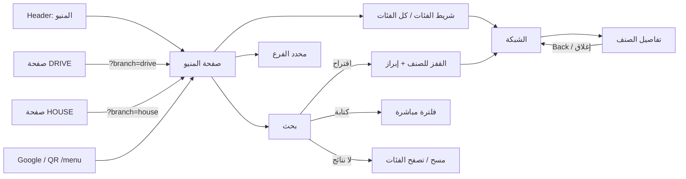

# USER FLOWS — Menu

> **الحالة:** `DRAFT — PENDING OWNER APPROVAL` · **آخر تحديث:** 2026-10-01
> **المرجع:** [`SHELTER-MENU-IA-SPEC.md`](SHELTER-MENU-IA-SPEC.md).
> الحالات المصوّرة في الـ[Wireframes](wireframes/README.md).

## الخريطة العامة

## F-01 فتح المنيو
1. **الدخول من Header أو Google:** تظهر الصفحة بالـHTML كاملة. النص والأسعار فورًا، والصور لاحقًا.
2. **الفرع:**
   - لا `?branch` ولا اختيار محفوظ ← "كل الفروع" + حالة الفرعين.
   - يوجد اختيار محفوظ ← يُطبّق. "كل الفروع" ظاهر للتغيير.
3. **الموسم:** يظهر قسم SPRING لأنه Active، ثم شريط الفئات والأقسام.
4. **القياس:** `menu_view` (اللغة، الفرع).

## F-02 البحث عن صنف
1. الضغط على الحقل (أو أيقونة البحث في الشريط اللاصق) ← تركيز + كيبورد.
2. **الكتابة من الحرف الثاني:**
   - حتى 5 اقتراحات.
   - الشبكة تتفلتر، و"N نتيجة" تُعلن لقارئ الشاشة.
3. **ثلاث نهايات:**
   - **(أ) ضغط اقتراح:** ← الاقتراحات تُغلق، والفلتر يُمسح، والقفز للصنف في مكانه مع إبراز 1.5 ثانية ← `menu_search` (`source=suggestion`).
   - **(ب) Enter:** ← تبقى النتائج المفلترة ← `menu_search` (`source=submit`).
   - **(ج) توقف عن الكتابة ثانية واحدة:** ← `menu_search` (`source=pause`)، مرة واحدة لكل نص.
4. **(×):** مسح وعودة للقائمة الكاملة.

## F-03 تغيير الفرع
1. ضغط DRIVE أو HOUSE ← الزر نشط، وسطر الحالة يعرض الفرع المختار.
2. `?branch=` يتحدث بلا خطوة جديدة في الـHistory، ويُحفظ الاختيار على الجهاز.
3. **مكان المستخدم لا يتغير** (يبقى داخل HOT DRINKS مثلًا).
4. **التوفر:**
   - اليوم `UNKNOWN`: لا تغيير في الأصناف.
   - لاحقًا: تطبيق Show / Hide / "متوفر في … فقط".
5. **القياس:** `branch_filter_change` (من ← إلى).

## F-04 فتح صنف
1. **الضغط على البطاقة:**
   - موبايل: Bottom Sheet.
   - ديسكتوب: Modal.
2. **الـHistory:** يُضاف `#p-{slug}`، والتركيز ينتقل لعنوان الصنف.
3. **المحتوى:** فقط الحقول المعتمدة (الاسم، السعر، الصورة إن وُجدت).
4. **القياس:** `product_view`.

## F-05 إغلاق الصنف
- **الطرق:** زر الإغلاق · سحب للأسفل · Back (الهاتف أو المتصفح) · `Esc` · الضغط على الخلفية.
- **النتيجة:** نفس موضع التمرير، والتركيز يعود للبطاقة.
- **Back مرة ثانية:** يخرج من المنيو كالمعتاد. لا خطوات History مخفية إضافية.

## F-06 اختيار فئة
1. **الضغط على زر في الشريط:**
   - تمرير للقسم مع تعويض ارتفاع الأشرطة اللاصقة.
   - بدون JS: Anchor عادي.
2. الزر يصبح نشطًا (`aria-current`). في HOT وCOLD وFIZZY يظهر الشريط الفرعي.
3. **القياس:** `menu_category_click` (`source=chip`).
4. **أثناء التمرير اليدوي:** الزر النشط يتغير تلقائيًا. لا يُرسل حدث.

## F-07 كل الفئات
1. **الزر (☰) في آخر الشريط** ← Sheet بقائمة الفئات التسع، مع عدد الأصناف والأقسام الفرعية.
2. **اختيار فئة أو قسم فرعي:** ← إغلاق ثم تمرير ← `menu_category_click` (`source=all_categories`).
3. **إغلاق دون اختيار:** ← لا شيء يتغير.

## F-08 الدخول من صفحة DRIVE
1. زر "المنيو" في صفحة DRIVE ← `/ar/jo/menu/?branch=drive`.
2. **سياق الرابط يتقدم على المحفوظ** ← DRIVE مختار، والحالة "مفتوح الآن — حتى 2:00 ص".
3. **لا سؤال إضافي.** "كل الفروع" متاح بضغطة.

## F-09 الدخول من صفحة HOUSE
مثل F-08 مع `?branch=house`.

## F-10 فرع مغلق
1. HOUSE مختار، والساعة 8:00 ص ← "مغلق الآن — يفتح 9:00 ص".
2. **المنيو كاملة متاحة للتصفح والبحث والتفاصيل.** لا منع ولا نافذة منبثقة.
3. **تحديث كل دقيقة:** عند 9:00 تتحول الحالة إلى "مفتوح الآن — حتى 10:00 م" بلا إعادة تحميل.

## F-11 فرع يغلق قريبًا
1. DRIVE مختار، والساعة 1:15 ص (وردية السبت بعد منتصف الليل) ← "يغلق بعد 45 دقيقة".
2. العدّ يتحدث كل دقيقة. عند 2:00 ص ← "مغلق الآن — يفتح 7:00 ص".

## F-12 صنف غير متوفر (عند وجود بيانات التوفر — مثال)

| حالة الصنف في الفرع | النتيجة |
|---|---|
| `UNAVAILABLE_SHOW` | البطاقة تبقى مع "غير متوفر حاليًا في HOUSE" (نص + خفوت) والسعر مقروء. التفاصيل تفتح وتعرض نفس السطر |
| `UNAVAILABLE_HIDE` | لا يظهر في هذا الفرع، ويظهر عند "كل الفروع" مع "متوفر في DRIVE فقط" |

**اليوم:** كل البيانات `UNKNOWN`، فلا يظهر شيء من هذا.

## F-13 بحث بلا نتائج
1. "xyz" ← "لا توجد نتائج لـ "xyz"" + [مسح البحث] + [تصفّح الفئات].
2. **أقرب فئة:** تُقترح فقط إذا طابق النص اسم فئة أو قسم فرعي (مثل "شاي" ← TEA).
3. **القياس:** `zero_result_search` (النص منظّف، اللغة، الفرع).
4. **[تصفّح الفئات]** ← يفتح "كل الفئات".
